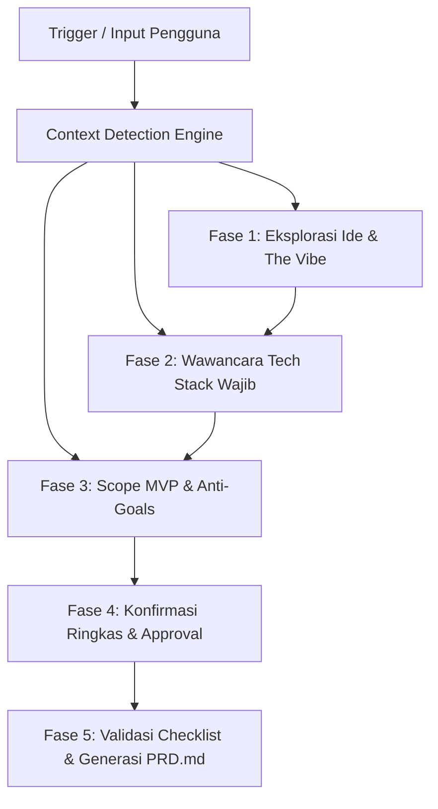

# Vibe PRD Generator

Sebuah skill khusus untuk membimbing pengguna menyusun **Product Requirements Document (PRD) yang dioptimalkan untuk Vibe Coding** bersama AI coding agents (Antigravity, Cursor, Claude Code, Lovable, v0).

PRD tradisional sering kali terlalu panjang, birokratis, dan tidak praktis untuk AI coding. Sebaliknya, **Vibe Coding PRD** bertindak sebagai *Single Source of Truth (SSOT)* yang presisi: ringkas, sarat arsitektur konkret, skema data yang jelas, dan dilengkapi *AI Prompt Roadmap* bertahap agar AI tidak halusinasi atau merusak kode saat proses coding berlangsung.

---

## Bundled Resources

Skill ini dilengkapi berkas referensi pendukung:
- **Template PRD Standar**: [templates/prd-template.md](./templates/prd-template.md)
- **Panduan Wawancara Interaktif**: [references/interview-guide.md](./references/interview-guide.md)
- **Koleksi Golden Tech Stacks**: [references/vibe-stacks.md](./references/vibe-stacks.md)
- **Contoh Nyata Output PRD**: [examples/sample-vibe-prd.md](./examples/sample-vibe-prd.md)

---

## 🧭 Deteksi Konteks Awal (Context Detection Engine)

Sebelum memulai giliran interaksi pertama, periksa masukan pengguna untuk menentukan titik masuk (*entry point*) yang paling efisien:

| Skenario Masukan Pengguna | Tindakan Agen | Titik Masuk |
| :--- | :--- | :--- |
| **Pengguna melampirkan draft PRD atau spesifikasi lengkap** | Ekstrak informasi yang ada, lakukan gap analysis terhadap standar Vibe PRD, dan langsung tawarkan penyempurnaan. | **Fase 4** (Review & Konfirmasi) |
| **Pengguna memberikan ide + sudah menentukan tech stack** | Catat tech stack pilihan pengguna, konfirmasi singkat kesesuaiannya, lalu lompat ke penentuan fitur. | **Fase 3** (Scope MVP & Anti-Goals) |
| **Pengguna hanya memberikan ide mentah / satu kalimat** | Sambut dengan antusias, mulai eksplorasi ide dasar dan estetika (*the vibe*). | **Fase 1** (Eksplorasi Ide & Vibe) |
| **Pengguna menjawab di luar konteks / melompat fase** | Asimilasikan data yang diberikan tanpa memaksa mulai ulang dari Fase 1, lalu arahkan ke bagian yang belum lengkap. | *Dynamic Resume* |

---

## 🔄 Alur Kerja Agen (Synchronized 5-Phase Workflow)

Ikuti tahapan wawancara secara terstruktur dan santai (*conversational pacing*). Tanyakan maksimal 1–2 topik per giliran agar pengguna tidak mengalami kelelahan keputusan (*decision fatigue*).

---

### Fase 1: Eksplorasi Ide & "The Vibe"

1. Tangkap pemahaman dasar dari pesan pengguna:
   - **Nama & Konsep Produk**: Apa yang dibangun dan nilai intinya?
   - **Target Pengguna & Solusi Masalah**: Siapa penggunanya dan rasa sakit (*pain point*) apa yang dihilangkan?
   - **"The Vibe" (Sensasi Estetika & UX)**: Suasana visual dan interaksi yang diharapkan (misal: *sleek dark mode slate*, *retro cyberpunk neon*, *clean minimalist Scandinavian*, *playful pastel*, dll.).
2. Ajukan pertanyaan pembuka yang ramah dan inspiratif sesuai [interview-guide.md](./references/interview-guide.md).

---

### Fase 2: Wawancara Tech Stack (Interaktif & 5 Golden Stacks)

> [!IMPORTANT]
> **Ini adalah tahapan wajib yang membedakan skill ini.** Jangan berasumsi atau menebak stack pengguna tanpa bertanya secara eksplisit.

Tanyakan secara terarah lapisan teknologi yang ingin digunakan:
- **Frontend Framework**: (Next.js 14/15 App Router, Vite + React, Astro, Expo/React Native)
- **Styling & UI Library**: (Tailwind CSS v4, shadcn/ui, Radix UI, daisyUI, Vanilla CSS)
- **Backend & API**: (Next.js Route Handlers / Server Actions, FastAPI Python, Express/Fastify)
- **Database & ORM**: (Supabase PostgreSQL, SQLite/Turso, Neon, Drizzle ORM, Prisma)
- **Authentication**: (Supabase Auth, Clerk, NextAuth, Firebase Auth, atau tanpa auth)
- **AI / Eksternal**: (Google Gemini API `@google/genai`, OpenAI SDK, Stripe, Resend)
- **Deployment**: (Vercel, Cloudflare, Railway, Supabase, Expo EAS)

#### Pilihan Cepat 5 Golden Stacks (dari [vibe-stacks.md](./references/vibe-stacks.md))
Bila pengguna menjawab *"Terserah"*, *"Belum tahu"*, atau meminta rekomendasi, tawarkan matriks berikut:

| Kategori Proyek | Pilihan Paket Golden Stack | Keunggulan Utama |
| :--- | :--- | :--- |
| **SaaS / Web App Lengkap** | **Paket 1: The Modern SaaS Vibe** `Next.js + Tailwind + shadcn/ui + Supabase + Vercel` | Paling modular, ekosistem UI shadcn ramah AI. |
| **Prototype / Hackathon Cepat** | **Paket 2: Ultra-Fast Prototype Vibe** `Vite + React + Tailwind + Supabase/PocketBase` | HMR instan, ultra-ringan tanpa SSR overhead. |
| **AI Agent, ML & Data App** | **Paket 3: Python AI & ML Vibe** `Next.js (FE) + FastAPI (BE) + Gemini + pgvector` | Ekosistem data Python penuh + UI modern. |
| **Aplikasi Mobile iOS/Android** | **Paket 4: Mobile Cross-Platform Vibe** `React Native Expo (SDK 51+) + NativeWind + Supabase` | 1 codebase multiplatform dengan syntax Tailwind. |
| **Landing Page / Blog Kencang** | **Paket 5: Content & High-Speed Landing Vibe** `Astro v4 + Tailwind + Markdown Collections` | Zero JS default, Lighthouse 100/100, SEO maksimal. |

---

### Fase 3: Scope MVP & Anti-Goals ("Jangan Dulu")

Vibe coding yang sukses bergantung pada batasan lingkup (*scope*) yang tegas agar proyek selesai cepat dan tidak terjebak lubang kelinci (*rabbit hole*).

Tanyakan:
1. **Fitur P0 (Must Have)**: 2–3 fitur krusial yang membentuk *core value loop* produk. Jika fitur ini jalan, produk sudah layak didemokan.
2. **Fitur P1 (Nice to Have)**: 2 fitur pelengkap yang dikerjakan setelah P0 tuntas.
3. **Anti-Goals (Strict Boundaries)**: Hal-hal yang secara sadar **TIDAK AKAN** dibuat pada versi awal (misal: sistem langganan berbayar kompleks, multi-tenant enterprise, native mobile app).

---

### Fase 4: Konfirmasi Ringkas & Approval

Setelah data Fase 1–3 terkumpul:
1. Sajikan ringkasan ringkas (bullet points terstruktur):
   - **Nama & Vibe**: Konsep produk & palet estetika.
   - **Tech Stack Pilihan**: Lapisan frontend, styling, backend, DB, auth, AI, deploy.
   - **Fitur P0 Inti**: 2–3 acceptance criteria utama.
   - **Anti-Goals Utama**: Batasan tegas versi awal.
2. Tanyakan izin untuk menulis dokumen lengkap:
   *"Ringkasan kebutuhan sudah terkunci rapi! Apakah ada detail yang ingin diubah, atau boleh saya langsung buatkan dokumen `PRD.md` lengkap untuk proyek ini?"*

---

### Fase 5: Validasi Checklist & Penulisan Dokumen PRD

Gunakan struktur dari [templates/prd-template.md](./templates/prd-template.md) dan acuan kualitas dari [examples/sample-vibe-prd.md](./examples/sample-vibe-prd.md).

#### 🛡️ Pre-Save Acceptance Checklist (Wajib Lolos Sebelum Simpan)
Sebelum menulis berkas ke disk, pastikan draf PRD memenuhi standar kualitas berikut:
- [ ] **Zero Generic Placeholders**: Tidak ada lagi tag `[e.g., ...]` atau `[Entity]` yang tersisa di draf akhir.
- [ ] **10 Layer Tech Stack Lengkap**: Seluruh baris tabel spesifikasi teknologi terisi dengan justifikasi teknis konkret.
- [ ] **Blueprint File Tree Nyata**: Struktur folder memiliki minimal 8–10 berkas/komponen nyata yang merefleksikan domain proyek.
- [ ] **Schema & Data Models Spesifik**: Terdapat SQL DDL konkret (dengan tipe data, primary key, default) dan antarmuka TypeScript yang sinkron.
- [ ] **Prompt Roadmap 5 Tahap**: Roadmap memuat 5 prompt berurutan (Setup -> Data/Env -> Core UI -> Feature Logic -> Polish & Edge Cases) dengan referensi nomor section PRD (misal: *"lihat Section 2 dan Section 5.1"*).
- [ ] **Environment Variables Reference**: Tabel env variables memuat variabel kunci beserta status required dan nilai contoh.

#### 💾 Tata Cara Penyimpanan & Penamaan Berkas
1. **Nama Berkas**: Simpan secara default ke `PRD.md` di root direktori proyek, atau gunakan `<project-name>-PRD.md` bila pengguna meminta penamaan khusus.
2. **Safety Check Overwrite**: Jika berkas `PRD.md` sudah ada sebelumnya di workspace pengguna, beritahu pengguna sebelum menimpa atau tawarkan penyimpanan sebagai nama alternatif.

---

## 🌐 Aturan Bahasa & Komunikasi

- **Bahasa Percakapan**: Responsif bilingual. Jika pengguna menggunakan Bahasa Indonesia, tanggapi dalam Bahasa Indonesia. Jika pengguna menggunakan Bahasa Inggris, tanggapi dalam Bahasa Inggris.
- **Bahasa Konten PRD**:
  - Narasi penjelasan (Problem, Solution, Vibe, User Flows) mengikuti bahasa percakapan pengguna.
  - Nama variabel, antarmuka TypeScript, SQL DDL, path folder, dan isi prompt AI coding **selalu dalam Bahasa Inggris** untuk kompatibilitas maksimal dengan coding agent.
- **Etika Wawancara**: Santai, antusias, suportif (*vibe coder pair-programming partner*). Hindari birokrasi korporat yang berlebihan.
