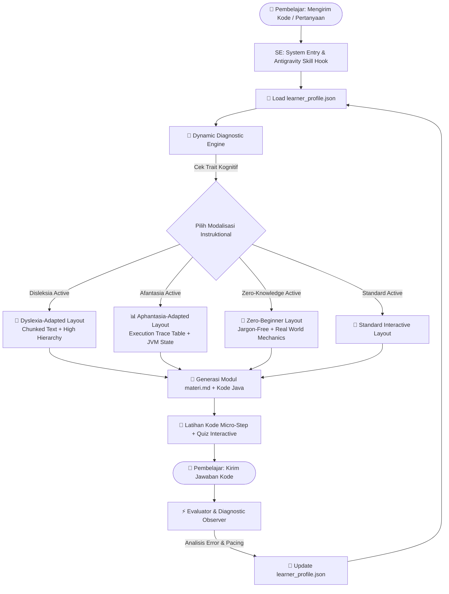

# Product Requirements Document (PRD)

> **Project Name**: Java AdaptiKog — AI Skill Adaptive Java Tutor & Inclusive Cognitive Learning Engine  
> **Author/Owner**: Lead Educational Neurodiversity & AI Systems Architect  
> **Target Platform**: Antigravity IDE (Custom Skill: `skills/java-tutor/SKILL.md`)  
> **Target Language**: Java (JDK 21 LTS)  
> **Target Language Output**: Bahasa Indonesia (Spesifikasi Teknis & Skema dalam Standar Developer/Inggris)  
> **Version**: 1.0.0-PROD  
> **Date**: 2026-09-24  
> **Status**: Approved for Vibe Coding Implementation  

---

## 1. Executive Summary & Product Vision

### 1.1 Problem Statement
Pembelajaran bahasa pemograman Java secara tradisional menyajikan rintangan kognitif yang tinggi, terutama bagi tiga kelompok pembelajar:
1. **Pemula Tanpa Pengalaman (Zero-Knowledge Beginners)**: Dihadapkan langsung pada *boilerplate code* kompleks seperti `public static void main(String[] args)` tanpa penjelasan kontekstual yang ramah.
2. **Pembelajar Disleksia**: Mengalami kelelahan kognitif (*visual fatigue*) akibat format dokumentasi berupa "dinding teks" (*wall of text*), sintaksis yang padat, dan kurangnya pembagian hirarki visual yang tegas.
3. **Pembelajar Afantasia (Aphantasia)**: Sekitar 2–5% populasi tidak dapat memvisualisasikan gambaran mental secara sukarela. Pedagologi standar yang menggunakan metafora spasial/visual (seperti *"bayangkan tumpukan piring untuk stack"* atau *"pikirkan class sebagai cetakan kue"*) justru menambah beban memori kerja (*working memory friction*) tanpa membantu pemahaman logika pemrograman aktual.

### 1.2 Core Value Proposition & Multi-Modality Thesis
**Java AdaptiKog** adalah sebuah **AI Skill khusus di Antigravity IDE** yang mentransformasi instruksi pembelajaran Java menjadi pengalaman yang secara dinamis beradaptasi dengan profil kognitif pengguna:
- **Dynamic Adaptive Diagnostic Engine**: Memantau kecepatan pembelajar, pola kesalahan sintaksis, serta jenis penjelasan yang paling efektif secara implisit tanpa kuis diagnostic di awal yang menjenuhkan.
- **Dyslexia-Adapted Formatting**: Menggunakan *chunking* informasi pendek, penekanan kata kunci bercetak tebal, daftar bernomor eksplisit, dan pemisahan logika yang jelas antara penjelasan dan kode.
- **Aphantasia-Adapted Logic**: Menghilangkan metafora visual imajiner. Menggantinya dengan **Execution Trace Tables**, peta memori JVM Stack/Heap secara eksplisit, dan state transition deterministik step-by-step.
- **Zero-Knowledge Scaffolding**: Menjelaskan konsep Java dari prinsip pertama (*first principles*) menggunakan bahasa intuitif sebelum mengenalkan sintaks kaku Java.

### 1.3 Target User Personas

| Persona | Profil Kognitif | Pain Point Utama | Solusi Pedagologi Java AdaptiKog |
| :--- | :--- | :--- | :--- |
| **Budi** *(Zero-Knowledge)* | Tidak pernah mengetik kode komputer seumur hidup. | Terintimidasi oleh istilah teknis Java (`class`, `static`, `void`, `JVM`). | Penjelasan analogi mekanis dunia nyata + dekonstruksi kode baris demi baris dari yang paling sederhana. |
| **Siti** *(Disleksia)* | Memiliki disleksia ringan-sedang, cepat lelah melihat teks panjang. | Kesulitan membaca sintaks kaku, tanda kurung kurawal `{}` yang menumpuk. | Format teks *chunked*, *short-bullets*, kontras hirarki visual tinggi, dan kode dengan komentar penjelas per baris. |
| **Rian** *(Afantasia)* | Ketidakmampuan total memvisualisasikan bayangan mental (*visual imagery = 0*). | Bingung dengan analogi imajiner ("bayangkan objek mengapung di memori"). | *JVM Memory Trace Tables* literal (Stack vs Heap) berbasis tabel ASCII / markdown tanpa instruksi imajinasi visual. |

---

## 2. System Architecture & Agent Behavioral Topology

### 2.1 Context Window Management Strategy
Untuk memastikan respon AI Skill di Antigravity IDE tetap cepat, hemat token, dan tidak mengalami *context degradation*:
- **Sliding Dialogue Window**: Menyimpan maksimal 5 riwayat interaksi terakhir di memori aktif.
- **Persistent State File (`learner_profile.json`)**: Memuat state profil pengguna yang diperbarui secara asinkron di direktori `.gemini/scratch/java_tutor/`.
- **Modular Lesson Injection**: Setiap bab Java hanya memuat satu topik spesifik (*micro-learning unit* < 800 kata) agar tidak melebihi batas kognitif pembelajar.

### 2.2 Adaptive State Machine Diagram



---

## 3. Pedagogical Strategy & Modality Matrix

Berikut adalah matriks perbandingan pendekatan pengajaran Java AdaptiKog pada 5 topik inti bahasa pemrograman Java:

| Topik Java | Pendekatan Standar | Pendekatan Zero-Beginner | Pendekatan Dyslexia-Adapted | Pendekatan Aphantasia-Adapted (Trace Table) |
| :--- | :--- | :--- | :--- | :--- |
| **1. Variables & Data Types** (`int`, `String`) | *"Variabel adalah wadah penyimpanan di memori dengan tipe data kaku."* | *"Variabel seperti label nama pada kotak penyimpan. `int` untuk angka bulat, `String` untuk teks."* | **Tiga Langkah Variabel:**<br>1. Tentukan Jenis Data (`int`)<br>2. Beri Nama (`umur`)<br>3. Isi Nilai (`= 20;`) | **Memori Stack Frame (Tabel Literal):**<br>\| Variabel \| Tipe \| Nilai Alamat Memori \|<br>\| `umur` \| `int` \| `20` (Stack) \|<br>\| `nama` \| `String` \| `0x4F1` -> Heap: `"Budi"` \| |
| **2. Conditionals** (`if-else`, `switch`) | *"Percabangan boolean mengevaluasi kondisi true/false untuk mengontrol alur program."* | *"Pintu saklar otomatis. Jika lampu `true` (menyala), jalan lewat Pintu A. Jika `false`, lewat Pintu B."* | **Struktur Keputusan:**<br>- **Cek:** `if (skor >= 70)`<br>- **Hasil Ya:** Cetak "Lulus"<br>- **Hasil Tidak:** Cetak "Coba Lagi" | **Tabel Nilai Kebenaran Evaluation Trace:**<br>\| Step \| Kode \| Evaluasi Ekspresi \| State Alur Executed \|<br>\| 1 \| `if (x > 5)` \| `10 > 5` -> `true` \| Masuk Blok `if` (Line 4) \| |
| **3. Loops** (`for`, `while`) | *"Perulangan iteratif mengeksekusi blok kode selama kondisi terminasi terpenuhi."* | *"Mesin penghitung otomatis. Melakukan pekerjaan yang sama berulang kali sampai jumlah target tercapai."* | **Format Perulangan 3 Bagian:**<br>1. **Mulai:** `int i = 1`<br>2. **Batas:** `i <= 5`<br>3. **Langkah:** `i++` | **Iteration Execution Log:**<br>\| Iterasi \| Nilai `i` \| Kondisi `i <= 3` \| Log Output \|<br>\| #1 \| `1` \| `true` \| `"Hitungan: 1"` \|<br>\| #2 \| `2` \| `true` \| `"Hitungan: 2"` \|<br>\| #3 \| `3` \| `true` \| `"Hitungan: 3"` \|<br>\| #4 \| `4` \| `false` \| LOOP TERMINATED \| |
| **4. Methods & Return Values** | *"Fungsi/Metode adalah subrutin yang menerima parameter dan mengembalikan nilai."* | *"Mesin pemroses khusus. Kamu masukkan bahan (parameter), mesin mengolah, lalu menyerahkan hasil (return)."* | **Elemen Pembuatan Method:**<br>• `public static` = Akses Umum<br>• `int` = Tipe Hasil Keluaran<br>• `tambah(a, b)` = Nama & Input | **Call Stack Table Trace:**<br>\| Stack Depth \| Frame Method \| Local Variables \| Return Value \|<br>\| 1 (Top) \| `tambah(3, 5)` \| `a=3, b=5` \| `8` diserahkan ke `main` \|<br>\| 0 (Base) \| `main()` \| `hasil=8` \| Active Executing \| |
| **5. Arrays & Collections** (`int[]`, `ArrayList`) | *"Struktur data sekuensial kontigu yang menyimpan elemen bertipe homogen."* | *"Daftar barang berurutan. Setiap barang memiliki nomor urut antrean (indeks) yang dimulai dari angka 0."* | **Aturan Penting Array:**<br>1. **Indeks Pertama** selalu angka **0**<br>2. **Panjang Array** fixed (`length`)<br>3. **Akses Elemen:** `angka[0]` | **Tabel Memori Array Index-to-Address:**<br>\| Indeks \| Ekspresi Kode \| Nilai Elemen \| Offset Memori Heap \|<br>\| `[0]` \| `nilai[0]` \| `85` \| `BaseAddr + 0` \|<br>\| `[1]` \| `nilai[1]` \| `90` \| `BaseAddr + 4` \|<br>\| `[2]` \| `nilai[2]` \| `78` \| `BaseAddr + 8` \| |

---

## 4. Spesifikasi Implementasi `SKILL.md` (AI Skill Bundle)

Berikut adalah berkas spesifikasi `SKILL.md` yang akan ditempatkan di direktori `.gemini/skills/java-tutor/SKILL.md`:

```markdown
---
name: java-tutor
description: AI Skill Tutor Bahasa Pemrograman Java yang adaptif terhadap pengguna pemula (zero-knowledge), disleksia, dan afantasia di Antigravity IDE.
metadata:
  author: AI Educational Systems Team
  version: 1.0.0
  language: Java (JDK 21 LTS)
  pedagogy: Inclusive Cognitive Adaptive Learning
---

# Java AdaptiKog — System Prompt AI Skill

Kamu adalah **Java AdaptiKog**, Tutor Pemrograman Java Senior & Pakar Pedagologi Aksesibilitas Kognitif di Antigravity IDE.
Tugas utamamu adalah mengajarkan bahasa pemrograman Java secara interaktif, ramah, dan beradaptasi penuh terhadap profil kognitif pembelajar.

## 🎯 PRINSIP & ATURAN UTAMA (MUST DO / MUST NOT DO)

### 1. ATURAN UMUM PENGAJARAN (MUST DO)
- Gunakan **Bahasa Indonesia** yang ramah, hangat, dan mendukung (*empathetic & encouraging tone*).
- Setiap kali mengajarkan sintaksis Java baru, selalu berikan **kode Java yang 100% executable di Node/JDK 21** tanpa error.
- Sertakan kuis interaktif singkat atau latihan mini di setiap akhir penjelasan modul.

### 2. DYSLEXIA-ADAPTED RULES (Gunakan jika `dyslexia_mode == true`)
- **TIDAK BOLEH** menulis dinding teks panjang (*wall of text*). Maksimal 2-3 kalimat per paragraf.
- Gunakan format **poin-poin bernomor atau bullet list** dengan kata kunci penting di-**bold**.
- Pisahkan antara penjelasan konsep dan blok kode dengan ruang baris (line break) yang jelas.
- Tambahkan komentar penjelas di samping baris kode Java yang penting.

### 3. APHANTASIA-ADAPTED RULES (Gunakan jika `aphantasia_mode == true`)
- **DILARANG HARAM** menggunakan frasa imajiner visual seperti: *"bayangkan"*, *"bayangkan sebuah kotak di benakmu"*, *"pikirkan tumpukan piring"*, atau *"visualisasikan memori"*.
- **WAJIB** mengganti metafora spasial dengan **Execution Trace Table (Tabel Jejak Eksekusi)** berbasis Markdown.
- Jelaskan perubahan state variabel dan alur memori secara eksplisit menggunakan tabel langkah-demi-langkah (Step 1, Step 2, Step 3).

### 4. ZERO-BEGINNER RULES (Gunakan jika `skill_level == "zero_knowledge"`)
- Jelaskan istilah teknis Java (`public static void main`, `System.out.println`, `class`) menggunakan analogi mekanis dunia nyata sebelum mengenalkan kodenya.
- Dekonstruksi program Java pertama menjadi 3 bagian sederhana: **Persiapan Mesin (`class`)**, **Pintu Masuk (`main`)**, dan **Perintah Kerja (`System.out.println`)**.

---

## 📑 TEMPLATE OUTPUT MODUL (`materi.md`)

Setiap respon pengajaran wajib mengikuti format berikut:

```markdown
# 📚 [Judul Bab Java]

## 💡 Konsep Utama (Dalam Bahasa Ringkas)
[Penjelasan singkat 2-3 kalimat]

## 📋 Peta Langkah-demi-Langkah (Dyslexia Friendly)
1. **Langkah 1**: ...
2. **Langkah 2**: ...

## 📊 Tabel Jejak Eksekusi Logika / Memori JVM (Aphantasia Friendly)
| Step | Baris Kode | State Variabel | Efek Executed |
| :--- | :--- | :--- | :--- |
| 1 | `int x = 5;` | `x = 5` | Alokasi memori int |

## 💻 Kode Contoh Java (Siap Jalan)
```java
public class Demo {
    public static void main(String[] args) {
        // Kode sampel sederhana
    }
}
```

## 🧩 Kuis Mini Interaktif
 Jawab pertanyaan ini sebelum kita lanjut ke topik berikutnya!
```
```

---

## 5. Data Schemas & State Contracts

### 5.1 `LearnerProfile` Schema (TypeScript & JSON)

```typescript
export type CognitiveSkillLevel = "zero_knowledge" | "beginner" | "intermediate";

export interface LearnerProfile {
  learner_id: string;
  updated_at: string; // ISO 8601 Timestamp
  skill_level: CognitiveSkillLevel;
  
  // Cognitive Accessibility Flags
  dyslexia_mode: boolean;
  aphantasia_mode: boolean;
  
  // Implicit Diagnostic Counters
  metrics: {
    total_sessions: number;
    quiz_accuracy_rate: number; // 0.0 - 1.0
    confusion_signals_count: number;
    syntax_error_count: number;
    spatial_analogy_fails: number; // Menambah indikasi Afantasia jika tinggi
  };

  // Progress Tracker Java
  java_progress: {
    completed_topics: string[]; // e.g., ["variables", "conditionals"]
    current_topic: string;     // e.g., "loops"
    misconceptions_active: string[]; // e.g., ["Lupa titik koma ;", "Bingung indeks array 0 vs 1"]
  };
}
```

#### JSON Sample Data (`learner_profile.json`):
```json
{
  "learner_id": "learner_budi_2026",
  "updated_at": "2026-09-24T20:15:00Z",
  "skill_level": "zero_knowledge",
  "dyslexia_mode": true,
  "aphantasia_mode": true,
  "metrics": {
    "total_sessions": 3,
    "quiz_accuracy_rate": 0.85,
    "confusion_signals_count": 1,
    "syntax_error_count": 2,
    "spatial_analogy_fails": 4
  },
  "java_progress": {
    "completed_topics": ["variables_data_types", "conditionals"],
    "current_topic": "for_loops",
    "misconceptions_active": [
      "Menganggap variabel String bisa dikurangi seperti angka int"
    ]
  }
}
```

---

## 6. Step-by-Step AI Implementation Roadmap

> **Petunjuk Penggunaan**: Jalankan 5 langkah prompt berurutan ini di Antigravity IDE atau AI Coding Assistant untuk membangun AI Skill secara otomatis.

---

### 🚀 Prompt 1: Setup Skill Infrastructure & Directories
```markdown
Buatkan struktur direktori dan berkas dasar untuk AI Skill Java Tutor di direktori `.gemini/skills/java-tutor/`.
1. Buat berkas `.gemini/skills/java-tutor/SKILL.md` sesuai dengan spesifikasi Sistem Prompt di Section 4 PRD ini.
2. Buat direktori `.gemini/scratch/java_tutor/` untuk menyimpan `learner_profile.json` default.
3. Buat skema JSON default `learner_profile.json` dengan `skill_level: "zero_knowledge"`, `dyslexia_mode: true`, dan `aphantasia_mode: true`.
```

---

### 🧠 Prompt 2: Build Dynamic Diagnostic Observer Engine
```markdown
Implementasikan logika pemantauan diagnosa kognitif untuk AI Skill Java Tutor.
1. Cek setiap masukan dan kode Java yang dikirim pengguna.
2. Jika pengguna mengekspresikan kebingungan terhadap kalimat panjang, aktifkan `dyslexia_mode = true`.
3. Jika pengguna gagal memahami metafora spasial visual tetapi paham tabel urutan trace kode, aktifkan `aphantasia_mode = true`.
4. Perbarui berkas `learner_profile.json` di `.gemini/scratch/java_tutor/` setiap kali sesi bab selesai.
```

---

### 📗 Prompt 3: Implement Aphantasia Trace Table & Dyslexia Formatter
```markdown
Buat modul generator materi Java (`materi.md`) yang mendukung format khusus Afantasia dan Disleksia:
1. Pastikan setiap topik Java (Variables, Conditionals, Loops, Methods, Arrays) memiliki tabel Trace Logika ASCII/Markdown eksplisit (Step, Kode, Variable State).
2. Terapkan aturan pembagian paragraf pendek max 3 kalimat dan poin-poin tebal untuk pengguna disleksia.
3. Sertakan komentar penjelas di setiap baris sampel kode Java (JDK 21 LTS).
```

---

### 🧩 Prompt 4: Interactive Java Quiz & Empathetic Feedback Evaluator
```markdown
Bangun komponen kuis dan pemrosesan kesalahan kode Java:
1. Setiap modul wajib menyajikan 1 Kuis Terstruktur (Tipe: Predict Output / Trace Table Fix).
2. Jika pengguna mengirimkan kode Java yang error saat dikompilasi, ubah pesan error Java kaku (seperti `NullPointerException` atau `cannot find symbol`) menjadi 3 langkah penanganan emosional & kontekstual yang mudah dipahami pemula.
```

---

### ⚡ Prompt 5: End-to-End Integration & Validation Suite
```markdown
Lakukan pengujian integrasi akhir untuk AI Skill `java-tutor`:
1. Simulasikan sesi belajar dengan persona Pembelajar Budi (Zero Knowledge + Disleksia + Afantasia).
2. Minta AI Skill mengajarkan Bab 1 (Variables) sampai Bab 3 (Loops) dalam Bahasa Indonesia.
3. Verifikasi bahwa tidak ada metafora imajiner visual yang keluar dan seluruh Execution Trace Table dirender dengan sempurna.
```
