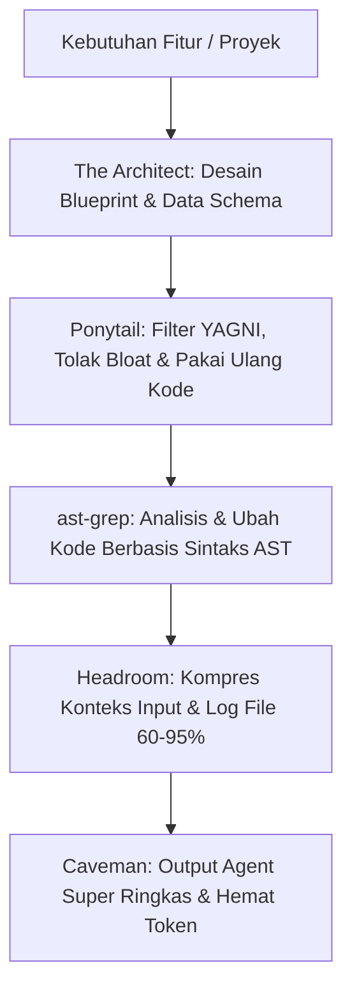

# Panduan Lengkap: Caveman, Ponytail, ast-grep / The Architect, & Headroom

Dokumentasi ini menjelaskan secara komprehensif konsep, cara instalasi, konfigurasi, dan penggunaan 4 tool/skill penting untuk optimalisasi AI Coding Agent (seperti Claude Code, Antigravity, Cursor, dan Windsurf).

---

## ⚠️ Diagnosa Masalah: Kenapa Muncul Error `/plugin` di PowerShell?

Saat Anda menjalankan perintah:
```powershell
PS D:\backup\prd> /plugin marketplace add DietrichGebert/ponytail
```
Muncul error:
> `/plugin : The term '/plugin' is not recognized as the name of a cmdlet...`

### Penyebab:
Perintah yang diawali garis miring (`/`) seperti `/plugin`, `/caveman`, `/ponytail` adalah **Slash Command internal di dalam sesi interaktif Claude Code CLI** (atau agent CLI sejenis), **bukan** perintah command-line Windows/PowerShell.

### Solusi:
1. Masuk ke sesi Claude Code terlebih dahulu di terminal:
   ```powershell
   claude
   ```
2. Setelah prompt interaktif `>` Claude Code terbuka, baru ketikkan slash command:
   ```text
   /plugin marketplace add DietrichGebert/ponytail
   /plugin install ponytail@ponytail
   ```

---

## ⚠️ Catatan Penting: Menambahkan Path Python Scripts ke Windows PATH

Dari log instalasi Pip Anda, script `headroom.exe`, `headroom-cache-ttl.exe`, dan `litellm.exe` dipasang di folder:
`C:\Users\GALAX\AppData\Roaming\Python\Python313\Scripts`

Agar command `headroom` dapat dipanggil langsung dari terminal mana saja, tambahkan folder tersebut ke User PATH:
1. Buka PowerShell dan jalankan:
   ```powershell
   [Environment]::SetEnvironmentVariable("Path", $env:Path + ";C:\Users\GALAX\AppData\Roaming\Python\Python313\Scripts", [EnvironmentVariableTarget]::User)
   ```
2. Restart terminal PowerShell Anda.

---

## 1. Caveman (Kompresi Token Output & Mode Ringkas)

### Apa itu Caveman?
Caveman adalah aturan komunikasi/skill ultra-kompresi yang dirancang untuk memotong konsumsi output token LLM secara drastis (hingga 50-80%) tanpa mengorbankan ketepatan teknis. Caveman membuang basa-basi, kata sambung pengisi (filler), dan format dekoratif, fokus pada inti fakta teknis: `[masalah] [tindakan] [alasan]. [langkah lanjut].`

### Level Intensitas Caveman
| Level | Karakteristik |
|---|---|
| **lite** | Menghilangkan basa-basi & permohonan maaf, tetap memakai kalimat lengkap & tata bahasa formal. |
| **full** *(Default)* | Menghapus kata sandang (*articles*), fragmen kalimat diperbolehkan, tanpa dekorasi emoji/tabel berlebih. |
| **ultra** | Super ringkas; satu fakta dinyatakan satu kali; menghilangkan konjungsi jika hubungan sebab-akibat tetap jelas. |
| **off** | Kembali ke mode bahasa normal/panjang. |

### Cara Menggunakan Caveman
1. **Di Antigravity / Gemini CLI:**
   - Cukup ketik di chat:
     ```text
     /caveman
     ```
     atau
     ```text
     caveman mode: ultra
     ```
     Untuk menonaktifkan, cukup katakan: `stop caveman` atau `normal mode`.

2. **Perintah Bantu (Sub-commands):**
   - `/caveman-compress`: Mengompres file dokumentasi/konfigurasi besar (seperti `CLAUDE.md`, backlog, atau todo list) agar hemat context window.
   - `/caveman-review`: Melakukan code review cepat dengan format 1 baris per temuan (lokasi, masalah, solusi).
   - `/caveman-commit`: Menulis Conventional Commit message yang padat dan fokus pada intensi.
   - `/caveman-help`: Menampilkan ringkasan status dan opsi level.

---

## 2. Ponytail (`DietrichGebert/ponytail`)

### Apa itu Ponytail?
Ponytail adalah rule/skill agentic dengan moto *"The best code is the code you never wrote"*. Mengubah persona AI Agent menjadi **"Lazy Senior Developer"** yang anti terhadap overengineering, bloated dependencies, dan kode berulang.

### Prinsip Kerja Ponytail (The Decision Ladder)
Sebelum menulis kode baru, agen dipaksa mengevaluasi tangga keputusan berikut:
1. **YAGNI (You Ain't Gonna Need It):** Apakah fitur ini benar-benar krusial sekarang? Jika tidak, jangan dibuat.
2. **Reuse:** Apakah helper, fungsi, atau komponen sejenis sudah ada di codebase? Pakai ulang.
3. **Stdlib:** Bisakah ini diselesaikan hanya dengan modul standar bahasa pemrograman?
4. **Native:** Bisakah memakai fitur native platform (contoh: tag `<dialog>` atau `<input type="date">` HTML daripada library UI eksternal)?
5. **Existing Dependencies:** Manfaatkan dependency yang sudah terpasang, tolak menambah dependency baru jika tidak esensial.
6. **Minimalism:** Jika cukup 1 baris kode yang aman dan readable, jangan buat file arsitektur baru.

*(Catatan: Ponytail tetap menjaga standar keamanan data, validasi boundary, dan aksesibilitas).*

### Cara Menginstal & Menggunakan Ponytail
1. **Di Claude Code CLI:**
   Masuk ke sesi Claude Code:
   ```powershell
   claude
   ```
   Lalu ketik di prompt Claude:
   ```text
   /plugin marketplace add DietrichGebert/ponytail
   /plugin install ponytail@ponytail
   ```
   Atau atur intensitasnya:
   ```text
   /ponytail lite
   /ponytail full
   /ponytail ultra
   ```

2. **Di Antigravity / Cursor / IDE Lain (Secara Manual):**
   Tambahkan file rule di direktori `.agents/rules/ponytail.md` atau `rules/ponytail.md` dengan instruksi inti:
   > "Adopt the Ponytail mindset: Prioritize simplicity, strict YAGNI, standard library over external dependencies, and reuse existing codebase utilities before authoring new abstractions."

---

## 3. ast-grep & The Architect

*(Catatan: Bagian ini mencakup `ast-grep` yang terinstall di environment Anda, serta plugin `The Architect` jika itu yang Anda maksud).*

### A. ast-grep (`sg` / Syntax-Aware Code Search)
`ast-grep` adalah alat pencarian dan refactoring kode berbasis sintaks (AST / Abstract Syntax Tree). Berbeda dengan `grep` biasa yang hanya mencari teks mentah (sehingga sering salah membaca komentar atau string), `ast-grep` memahami struktur kode bahasa pemrograman.

#### Cara Menggunakan ast-grep di Terminal:
1. **Pencarian Pola Kode (Pattern Match):**
   ```powershell
   # Mencari semua fungsi yang memiliki console.log
   sg --pattern 'function $FUNC($$$ARGS) { $$$; console.log($$$); $$$ }' --lang typescript
   ```
2. **Refactoring / Rewrite Kode:**
   ```powershell
   # Mengganti import require lama menjadi ES Import
   sg --pattern 'const $A = require($B)' --rewrite 'import $A from $B' --lang javascript
   ```
3. **Integrasi ke AI Agent:**
   Tambahkan ke file `AGENTS.md` atau `CLAUDE.md`:
   > *"Gunakan `ast-grep` (perintah: `sg`) sebagai alat utama untuk pencarian kode berstruktur dan refactoring, hindari plain-text grep untuk modifikasi AST."*

---

### B. The Architect (`Hainrixz/the-architect`)
Jika yang Anda maksud adalah **The Architect**, ini adalah plugin populer untuk Claude Code yang berperan sebagai Software Architect.

#### Fungsinya:
- Mewawancarai Anda mengenai kebutuhan proyek.
- Menyusun dokumen arsitektur dan blueprint spesifikasi teknis lengkap (`blueprint.md`).
- Menghasilkan rencana eksekusi modular yang siap dieksekusi oleh AI developer berikutnya tanpa kebingungan konteks.

#### Cara Pasang di Claude Code:
```text
/plugin marketplace add Hainrixz/the-architect
/plugin install the-architect@soyenriquerocha
```

---

## 4. Headroom (`headroom-ai`)

### Apa itu Headroom?
Headroom adalah layer kompresi konteks (Context Compression Layer) cerdas yang dirancang untuk AI Agent dan aplikasi LLM. Headroom memotong ukuran input data (seperti output command terminal, log file yang panjang, potongan kode RAG, dan JSON besar) sebesar **60% hingga 95%** sebelum dikirim ke LLM.

Keunggulan utamanya adalah **CCR (Content-Centric Reversible Compression)**: jika model LLM membutuhkan rincian data aslinya kembali, Headroom menyediakannya lewat sistem retrieval otomatis.

### Cara Menggunakan Headroom:

#### 1. Membungkus Agent CLI (`headroom wrap`)
Headroom dapat langsung membungkus CLI seperti Claude Code atau Aider untuk secara otomatis menyaring context stream:
```powershell
headroom wrap claude
```

#### 2. Menjalankan Headroom sebagai Local Proxy
Jalankan proxy lokal Headroom:
```powershell
headroom proxy --port 8787
```
Kemudian ubah `base_url` pada aplikasi atau konfigurasi LLM Anda (misalnya LiteLLM, OpenAI SDK, atau Cursor) ke:
`http://localhost:8787/v1`
Setiap request akan otomatis dikompresi sebelum diteruskan ke model target (Anthropic/OpenAI/Gemini).

#### 3. Menggunakan Python SDK Langsung
Di dalam script Python:
```python
from headroom import compress

raw_large_data = open("massive_log.json").read()

# Kompresi cerdas berbasis struktur JSON/AST
compressed_payload = compress(raw_large_data)

print(f"Ukuran asli: {len(raw_large_data)} -> Kompresi: {len(compressed_payload)}")
```

#### 4. Sebagai MCP Server (Model Context Protocol)
Headroom juga dapat didaftarkan sebagai MCP Server sehingga AI Agent dapat memanggil fungsi:
- `headroom_compress`: Mengompresi konteks riwayat / file besar.
- `headroom_retrieve`: Mengambil data mentah spesifik jika agen butuh detail lengkap.
- `headroom_stats`: Melihat berapa banyak token dan biaya yang berhasil dihemat.

---

## 5. Ringkasan & Alur Kerja Optimal (The Dream Team Setup)

Kombinasi keempat tool ini menghasilkan alur kerja AI yang sangat cepat, hemat biaya, dan minim bug:



1. **The Architect**: Merancang spesifikasi arsitektur yang solid di awal.
2. **Ponytail**: Menjaga agen agar tidak overengineering dan menulis kode sesedikit mungkin.
3. **ast-grep**: Memastikan pencarian dan modifikasi kode presisi secara sintaksis.
4. **Headroom**: Memangkas token input (log, output terminal, file).
5. **Caveman**: Memangkas token output (respon teks agen tetap padat, jelas, dan murah).
