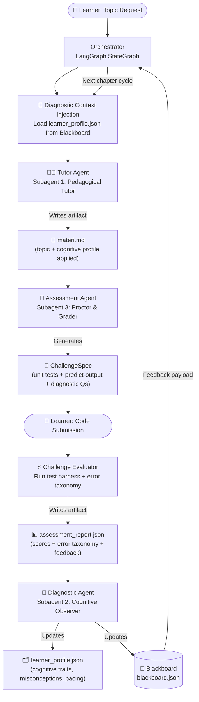
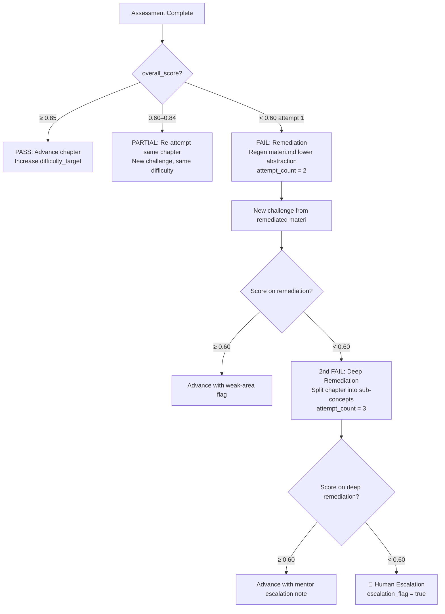

# Product Requirements Document (PRD)

> **Project Name**: AdaptIQ — Adaptive Multi-Agent Learning Platform  
> **Author/Owner**: Principal AI Systems Architecture Team  
> **Target Vibe**: Precision-Dark Cognitive Tools — deep slate `#0D1117`, electric violet `#7C3AED`, phosphor green `#22C55E`, mono-first typography  
> **Date**: 2026-09-22  
> **Status**: Approved for Build

---

## 1. Executive Summary & Product Vision

### 1.1 Problem Statement

Modern coding education platforms deliver a single, static explanation modality to every learner regardless of cognitive diversity. Learners with Aphantasia — an inability to voluntarily generate mental imagery, affecting an estimated 2–4% of the population — are systematically disadvantaged by pedagogy that relies on spatial metaphors such as "visualize a stack of plates" or "imagine nesting dolls." Beyond Aphantasia, each learner develops unique misconception signatures, pacing profiles, and abstraction preferences that a static curriculum cannot model or respond to. The result: high drop-off rates, prolonged time-to-competence, and an exclusionary learning environment for neurodivergent developers.

### 1.2 Core Value Proposition & Closed-Loop Multi-Agent Thesis

AdaptIQ replaces the static curriculum with a **closed-loop autonomous pipeline**. Three collaborative AI subagents share a Blackboard state store and continuously reshape pedagogical delivery based on real-time cognitive diagnostics and assessment results:

1. **Tutor Agent** generates modular `materi.md` files tailored to the learner's current `LearnerProfile`.
2. **Diagnostic Agent** silently observes interaction patterns, infers cognitive traits (including Aphantasia), and updates `learner_profile.json` after every assessment cycle.
3. **Assessment Agent** parses `materi.md`, generates unit-testable coding challenges, grades submissions, and emits structured `assessment_report.json` payloads back into the Blackboard.

Every assessment → diagnostic update → tutor adaptation cycle runs automatically, creating a **self-correcting pedagogical feedback loop** that converges toward each learner's optimal explanation modality.

### 1.3 Primary User Persona

**"Dev Dana"** — A self-paced developer with 1–3 years of experience in interpreted languages, pursuing mastery of advanced JavaScript runtime semantics (Event Loop, Closures, Prototypes). Dana works in 45-minute focused sessions, prefers CLI/file-based workflows over browser-based dashboards, and may or may not have the ability to form voluntary mental images. Dana's cognitive profile is initially unknown to the system and must be inferred from behavioral signals across the first 2–3 learning modules.

---

## 2. System Architecture & Agent Topology

### 2.1 Architectural Pattern

AdaptIQ uses a **Blackboard Architecture** layered atop a **LangGraph `StateGraph`** for orchestration:

- **Blackboard**: A shared, persistent JSON state store (`blackboard.json`) readable and writable by all three agents. Acts as the single source of truth for `LearnerProfile`, session history, and pending payloads.
- **StateGraph**: LangGraph's directed graph manages node transitions: `START → diagnostic_context_inject → tutor_agent → challenge_agent → submission_eval → diagnostic_update → END`. Edges are conditional on assessment outcomes.
- **File I/O Contract**: Each agent reads/writes named artifact files to a shared workspace directory (`./session/{session_id}/`). This decouples agents and enables async human-in-the-loop interactions.
- **Event Bus**: A lightweight Redis pub/sub (or in-process `asyncio.Queue` for single-machine deployments) notifies agents when new artifacts land in the session directory.

### 2.2 System Flow Diagram



### 2.3 Shared State & Orchestration Protocol

#### Blackboard Schema (`blackboard.json`)

```json
{
  "session_id": "sess_20260922_dana_001",
  "learner_id": "learner_dana_7f3a",
  "current_topic": "JavaScript Asynchronous Event Loop",
  "current_chapter": 2,
  "attempt_count": 1,
  "remediation_triggered": false,
  "pending_diagnostic_payload": null,
  "last_assessment_score": null,
  "agent_locks": {
    "tutor": false,
    "assessor": false,
    "diagnostician": false
  },
  "token_budget": {
    "session_total_tokens": 0,
    "tutor_budget_per_call": 4096,
    "assessor_budget_per_call": 2048,
    "diagnostician_budget_per_call": 1024
  }
}
```

#### Persistence Strategy

| Layer | Technology | Purpose |
| :--- | :--- | :--- |
| Hot State (blackboard) | SQLite via `aiosqlite` (or Redis) | Sub-millisecond read/write for agent coordination |
| Artifact Storage | Local filesystem `./session/{session_id}/` | `materi.md`, `assessment_report.json`, `learner_profile.json` |
| Long-term Memory | PostgreSQL (Supabase) | Cross-session `LearnerProfile` history and progression analytics |
| Vector Memory | pgvector on Supabase | Semantic retrieval of past misconceptions for diagnostic agent |

#### Token Budget Management

Each agent operates under a hard per-call token budget enforced by the orchestrator. If a Tutor Agent call approaches 90% of its budget, the orchestrator truncates by splitting the `materi.md` into two sequential chapters rather than compressing content quality. Diagnostic Agent calls are intentionally minimal (analysis-only, no generation) and capped at 1024 output tokens.

---

## 3. Detailed Subagent Specifications

### 3.1 Subagent 1: Pedagogical Tutor Agent (Material Architect)

#### System Persona & Guardrails

```
SYSTEM PROMPT (Tutor Agent):
You are AdaptIQ Tutor — a Principal Computer Science Educator with deep expertise in JavaScript runtime internals.
You receive a learning objective and a structured LearnerProfile JSON.
Your sole artifact output is a single file: materi.md.

GUARDRAILS:
- NEVER generate generic explanations. Every explanation must reference the LearnerProfile's
  current_misconceptions array.
- If cognitive_traits.visual_imagery_score <= 3, activate Aphantasia-Adapted Mode.
  Strip ALL metaphors using words like "imagine", "picture", "visualize", "think of X as".
  Replace with formal definitions, ASCII trace tables, and state machine notation.
- Estimated reading time MUST be calculated: (word_count / 200) minutes. Include in frontmatter.
- Do NOT produce code that is not directly runnable in Node.js 20+.
- Max output length: 4096 tokens per chapter. If content exceeds this, split into chapters
  and signal chapter_overflow: true in frontmatter.
```

#### Input Schema (TypeScript)

```typescript
interface TutorAgentInput {
  session_id: string;
  topic: string;                     // e.g., "JavaScript Asynchronous Event Loop"
  chapter_number: number;
  prerequisites: string[];           // e.g., ["call stack", "synchronous execution"]
  learner_profile: LearnerProfile;   // See Section 5
  previous_misconceptions: string[]; // From last assessment_report.json
  remediation_mode: boolean;         // true = re-teach failed concept at lower abstraction
}
```

#### Output Artifact: `materi.md`

```markdown
---
artifact_type: "materi"
session_id: "sess_20260922_dana_001"
topic: "JavaScript Asynchronous Event Loop"
chapter: 2
estimated_reading_time_minutes: 12
prerequisites: ["call stack", "synchronous execution", "setTimeout basics"]
cognitive_profile_applied: "aphantasia_adapted"
visual_imagery_score_at_generation: 2
remediation_mode: false
chapter_overflow: false
generated_at: "2026-09-22T10:00:00Z"
---

# Chapter 2: The Asynchronous Event Loop

## 1. Formal Definition

[Content generated based on cognitive_profile_applied...]

## 2. Execution Trace Table (Aphantasia-Adapted)

| Step | Call Stack State     | Web API Queue   | Microtask Queue | Macrotask Queue | Console Output |
|------|----------------------|-----------------|-----------------|-----------------|----------------|
| 1    | [main()]             | —               | —               | —               | —              |
| 2    | [main(), setTimeout] | timer(cb1, 0ms) | —               | —               | —              |

## 3. Annotated Code Specimen

```javascript
console.log('A');           // STACK: [main]            → PRINT: A
setTimeout(() => {          // STACK: [main, setTimeout] → WEB API: timer registered
  console.log('B');
}, 0);
Promise.resolve()
  .then(() => console.log('C')); // → MICROTASK: cb enqueued
console.log('D');           // STACK: [main]            → PRINT: D
// STACK CLEAR → drain microtask queue → PRINT: C → drain macrotask → PRINT: B
```

## 4. State Machine Specification

[State transition table or Mermaid stateDiagram for non-imagery learners]

## 5. Concept Check (Pre-Assessment Primer)

1. What is printed before microtasks drain?
2. Define the role of the microtask queue in the JavaScript runtime loop.
```

#### Tool Calling & File I/O Capabilities

| Tool | Purpose |
| :--- | :--- |
| `read_file(learner_profile.json)` | Load current cognitive profile |
| `read_file(blackboard.json)` | Check remediation flags |
| `write_file(materi.md)` | Emit primary artifact |
| `update_blackboard(key, value)` | Set `agent_locks.tutor = false` after write |

#### Failure Modes & Fallback Strategies

| Failure Mode | Detection | Fallback |
| :--- | :--- | :--- |
| Token budget exceeded | Token count > 3686 (90% of 4096) | Split chapter; set `chapter_overflow: true` |
| LLM hallucinated code | Sandboxed `node -e` subprocess fails | Retry with exact stderr injected into prompt |
| Profile load failure | `FileNotFoundError` on `learner_profile.json` | Use `DEFAULT_PROFILE` (visual_imagery_score: 5) |
| Remediation loop > 3x | `blackboard.attempt_count >= 3` | Write `escalation_flag: true` to blackboard |

---

### 3.2 Subagent 2: Cognitive Diagnostic & Profiling Agent (The Observer)

#### System Persona & Guardrails

```
SYSTEM PROMPT (Diagnostic Agent):
You are AdaptIQ Diagnostician — a cognitive science-informed learning analyst.
You receive structured assessment reports and interaction logs. You update the learner's
cognitive profile JSON.

GUARDRAILS:
- You NEVER diagnose clinical conditions. Output is a heuristic pedagogical profile only.
- Always include a diagnostic_confidence score (0.0 – 1.0) with your assessment.
- Never decrease visual_imagery_score by more than 2 points per session to avoid over-correction.
- If diagnostic_confidence < 0.4, do not change visual_imagery_score; only update misconceptions.
- NEVER expose profile data directly to the learner. Profiles are internal system state.
```

#### Input Schema (TypeScript)

```typescript
interface DiagnosticAgentInput {
  session_id: string;
  learner_id: string;
  assessment_report: EvaluationResult;   // From Assessment Agent
  interaction_log: InteractionEvent[];    // Timestamped user actions & explanation requests
  current_profile: LearnerProfile;
}

interface InteractionEvent {
  timestamp: string;
  event_type: "explanation_request" | "re_read" | "skip" | "confusion_signal" | "fast_pass";
  context_section: string;              // Section of materi.md that triggered event
  metaphor_type?: "spatial" | "formal" | "narrative";
}
```

#### Output Artifact: `learner_profile.json`

```json
{
  "learner_id": "learner_dana_7f3a",
  "updated_at": "2026-09-22T11:30:00Z",
  "cognitive_traits": {
    "visual_imagery_score": 2,
    "visual_imagery_score_history": [5, 4, 3, 2],
    "abstraction_preference": "formal_symbolic",
    "pacing_score": 7,
    "preferred_explanation_modality": "trace_table_plus_code"
  },
  "diagnostic_confidence": 0.82,
  "current_misconceptions": [
    "Believes microtasks and macrotasks share the same queue",
    "Conflates Web API timer resolution with synchronous setTimeout behavior"
  ],
  "resolved_misconceptions": [
    "Confused Promise resolution with synchronous return"
  ],
  "aphantasia_indicators": {
    "spatial_metaphor_confusion_events": 4,
    "formal_syntax_high_comprehension_events": 7,
    "score_delta_last_3_sessions": -3
  },
  "progression": {
    "topics_completed": ["call_stack", "synchronous_execution"],
    "topics_in_progress": ["async_event_loop"],
    "topics_pending": ["closures", "prototypes"]
  }
}
```

#### Aphantasia Heuristic Engine

```python
# Pseudocode: Aphantasia Heuristic Scoring
def update_imagery_score(profile, report, interaction_log):
    delta = 0

    # Signal 1: Spatial metaphor sections generated confusion events
    spatial_confusion = count_events(interaction_log,
        event_type="confusion_signal", metaphor_type="spatial")
    delta -= spatial_confusion * 0.5

    # Signal 2: Formal/trace sections generated fast-pass or high scores
    formal_success = count_events(interaction_log,
        event_type="fast_pass", metaphor_type="formal")
    delta -= formal_success * 0.3  # Lower score = more aphantasic

    # Signal 3: Assessment score divergence between section types
    if report.section_scores["spatial_analogy_questions"] < 0.5:
        if report.section_scores["trace_table_questions"] >= 0.8:
            delta -= 1.5  # Strong divergence signal

    delta = max(delta, -2.0)  # Clamp per-session delta
    new_score = max(0, min(10, profile.visual_imagery_score + delta))

    return new_score, compute_confidence(spatial_confusion, formal_success, report)
```

#### Tool Calling & File I/O Capabilities

| Tool | Purpose |
| :--- | :--- |
| `read_file(assessment_report.json)` | Parse evaluation payload |
| `read_file(learner_profile.json)` | Load current profile |
| `query_vector_memory(misconception_text)` | Retrieve similar past misconceptions |
| `write_file(learner_profile.json)` | Persist updated profile |
| `update_blackboard(pending_diagnostic_payload, ...)` | Signal orchestrator |

#### Failure Modes & Fallback Strategies

| Failure Mode | Detection | Fallback |
| :--- | :--- | :--- |
| Insufficient data | `len(interaction_log) < 3` | `diagnostic_confidence = 0.2`; no score update |
| Conflicting signals | High spatial confusion AND low formal success | Hold score; flag for manual review |
| Write collision | File lock conflict | Retry with exponential backoff (3 attempts, 200ms base) |

---

### 3.3 Subagent 3: Challenge & Assessment Agent (The Proctor & Grader)

#### System Persona & Guardrails

```
SYSTEM PROMPT (Assessment Agent):
You are AdaptIQ Proctor — a rigorous but pedagogically calibrated code assessment engine.
You parse materi.md and generate unit-testable coding challenges, predict-the-output puzzles,
and diagnostic questions. You evaluate student submissions against a structured rubric.

GUARDRAILS:
- Challenges MUST be directly derivable from concepts in the provided materi.md.
- Always generate AT MINIMUM: 1 predict-the-output, 1 unit-testable implementation,
  1 diagnostic free-response.
- All generated test cases must pass on the reference solution before emission.
- Error taxonomy is mandatory: classify every error as "conceptual_misunderstanding",
  "syntax_error", "edge_case_miss", or "performance_issue".
- Never emit binary correct/incorrect verdicts only. Always include actionable feedback
  referencing the specific materi.md section.
```

#### Input Schema (TypeScript)

```typescript
interface AssessmentAgentInput {
  session_id: string;
  materi_artifact_path: string;
  learner_profile: LearnerProfile;
  previous_errors: ErrorRecord[];
  difficulty_target: "foundation" | "standard" | "advanced";
}
```

#### Output Artifact: `assessment_report.json`

```json
{
  "report_id": "report_sess001_ch2_001",
  "session_id": "sess_20260922_dana_001",
  "chapter": 2,
  "topic": "JavaScript Asynchronous Event Loop",
  "generated_at": "2026-09-22T11:00:00Z",
  "challenges": [
    {
      "id": "ch2_predict_001",
      "type": "predict_the_output",
      "difficulty": "foundation",
      "prompt": "What is the exact console output of the following code, in order?",
      "code_snippet": "console.log('1');\nsetTimeout(() => console.log('2'), 0);\nPromise.resolve().then(() => console.log('3'));\nconsole.log('4');",
      "reference_answer": "1, 4, 3, 2",
      "reference_explanation": "Synchronous → microtask queue (Promise) → macrotask queue (setTimeout)"
    },
    {
      "id": "ch2_impl_001",
      "type": "implementation",
      "difficulty": "standard",
      "prompt": "Implement delayedSequence(tasks, delayMs) that executes async functions sequentially with a fixed delay.",
      "unit_tests": [
        {
          "test_id": "t1",
          "description": "Executes tasks in order",
          "code": "const log = []; await delayedSequence([async () => log.push(1), async () => log.push(2)], 10); assert.deepEqual(log, [1, 2]);"
        },
        {
          "test_id": "t2",
          "description": "Respects delay between tasks",
          "code": "const start = Date.now(); await delayedSequence([async () => {}, async () => {}], 50); assert(Date.now() - start >= 50);"
        }
      ],
      "reference_solution": "async function delayedSequence(tasks, delayMs) {\n  for (const task of tasks) {\n    await task();\n    await new Promise(r => setTimeout(r, delayMs));\n  }\n}",
      "materi_section_reference": "§2: Execution Trace Table"
    }
  ],
  "submission_evaluation": {
    "learner_submission": "// learner's code here",
    "overall_score": 0.72,
    "section_scores": {
      "predict_the_output": 1.0,
      "implementation_correctness": 0.5,
      "edge_case_coverage": 0.6,
      "trace_table_questions": 0.85,
      "spatial_analogy_questions": 0.4
    },
    "time_to_solution_minutes": 18,
    "error_taxonomy": [
      {
        "error_type": "conceptual_misunderstanding",
        "concept_area": "microtask_vs_macrotask_ordering",
        "description": "Implementation processes macrotasks before draining microtask queue.",
        "materi_reference": "materi.md §2: Execution Trace Table, Step 6",
        "actionable_feedback": "Revisit §2 trace table. After each macrotask, microtask queue must fully drain before next macrotask runs."
      }
    ],
    "pass_fail": "partial_pass",
    "remediation_recommended": true
  }
}
```

#### Tool Calling & File I/O Capabilities

| Tool | Purpose |
| :--- | :--- |
| `read_file(materi.md)` | Parse teaching content for challenge generation |
| `execute_code(code, tests)` | Sandboxed Node.js 20 execution |
| `read_file(learner_profile.json)` | Calibrate difficulty |
| `write_file(assessment_report.json)` | Emit graded report |

#### Failure Modes & Fallback Strategies

| Failure Mode | Detection | Fallback |
| :--- | :--- | :--- |
| Reference solution fails own tests | Pre-emit self-test | Regenerate challenge (max 2 retries) |
| Sandbox timeout > 5s | `asyncio.TimeoutError` | Partial score from static analysis |
| Hallucinated API in challenge | Static import check | Append "Node.js 20 built-ins only" to prompt; retry |
| Learner submission crashes harness | Uncaught exception | Isolate; classify `syntax_error`; continue remaining challenges |

---

## 4. Cognitive Profiling & Aphantasia Adaptation Framework

### 4.1 Pedagogical Rationale

Aphantasia is characterized by the inability to voluntarily generate mental imagery. Standard coding pedagogy relies on visuospatial analogies: "the call stack is a stack of plates," "closures carry a backpack," "the prototype chain is a family tree." For Aphantasic learners (VVIQ ≤ 16/80), these metaphors actively consume cognitive resources attempting to construct imagery that cannot be formed, creating working-memory friction that crowds out the actual computational concept.

Research (Zeman et al., 2015; Keogh & Pearson, 2018) establishes that Aphantasic individuals demonstrate superior performance in formal, symbolic, and propositional reasoning tasks — the same modality in which computer systems actually operate. Aphantasia-Adapted Mode is therefore not a degraded experience: it is the pedagogically *more precise* one.

### 4.2 Behavioral Heuristics & Diagnostic Probing Patterns

The system uses an **implicit** VVIQ-inspired protocol. Learners are never asked "do you have Aphantasia?" The system probes through pedagogical behavior:

**Probe Pattern 1: Dual-Section `materi.md`**  
Initial chapters include both a spatial-metaphor section and a formal-trace section covering the same concept. Assessment questions map specifically to each section type. Score divergence signals visual imagery profile.

**Probe Pattern 2: Explanation-Request Taxonomy**  
Clarification offers two options: Option A "Let me use an analogy…" (spatial) vs. Option B "Let me trace execution step-by-step…" (formal). Consistent selection of Option B across ≥3 chapters is a strong Aphantasia signal.

**Probe Pattern 3: Predict-the-Output Performance**  
High performance on trace challenges combined with low performance on "which analogy best describes X" questions is the primary diagnostic signal.

### 4.3 Comparative Teaching Strategy Matrix

| Concept | Standard Pedagogical Approach | Aphantasia-Adapted Approach |
| :--- | :--- | :--- |
| **Scope / Closures** | "Russian nesting dolls" / "backpack carrying outer variables" | Formal Environment Record: `{ outer: EnvRecord_parent, bindings: { x: 1 } }`. Identifier lookup algorithm: check `EnvRecord.bindings` → follow `outer` pointer → repeat until `null` (ReferenceError). |
| **Event Loop & Queue** | "Restaurant kitchen order ticket line" / "conveyor belt" | State transition table: 5 named states `RUNNING → STACK_EMPTY → DRAIN_MICROTASK → DRAIN_MACROTASK → IDLE`. ASCII trace showing `microtaskQueue.shift()`, `macrotaskQueue.shift()` operations. |
| **Object Prototypes** | "Family tree" / "DNA inheritance chain" | Hidden `[[Prototype]]` slot traversal: `obj.prop` → check `obj.ownProperties` → follow `obj.[[Prototype]]` → repeat until `Object.prototype.[[Prototype]] = null`. Formal linked-list model. |
| **Async/Await** | "Pausing a cooking process to let the oven work" | Formal desugaring: `await expr` ≡ `Promise.resolve(expr).then(continuationFn)`. Coroutine state machine: `SUSPENDED → RESUMED → COMPLETED` states. |
| **Array Methods (map/filter)** | "Assembly line / factory pipeline" | Higher-order function definition: `map(arr, fn) = [fn(arr[0]), ..., fn(arr[n-1])]`. Explicit index traversal table: input index → transformation → output index. |

### 4.4 Ethical Boundaries & Disclaimer

> [!IMPORTANT]
> **Ethical Disclosure — Educational Heuristic Only**
>
> The AdaptIQ cognitive profiling system generates a **heuristic pedagogical profile** based solely on in-platform learning behavior. It does **NOT** constitute a clinical assessment, neuropsychological evaluation, or diagnosis of Aphantasia or any other cognitive condition.
>
> The `visual_imagery_score` is an internal pedagogical calibration parameter that influences explanation modality only. It is never disclosed to the learner in raw form. The system presents adaptation as "switching to a different explanation style" — never as a cognitive diagnosis.
>
> Clinical Aphantasia assessment requires validated instruments (VVIQ, SUIS) administered by qualified practitioners. The system's heuristics are beneficial even if the inferred profile is imperfect: formal, trace-based explanations are pedagogically rigorous for all learner types.

---

## 5. Data Schemas & Contracts (TypeScript & JSON)

### 5.1 Complete TypeScript Interface Definitions

```typescript
// ============================================================
// Core Cognitive & Learner Profile Types
// ============================================================

export type AbstractionPreference =
  | "visual_spatial"    // Prefers metaphors & diagrams
  | "formal_symbolic"   // Prefers definitions, state machines, tables
  | "narrative"         // Prefers story-based explanations
  | "mixed";            // No strong preference detected

export type ExplanationModality =
  | "standard"
  | "aphantasia_adapted"
  | "hybrid";

export interface CognitiveTraits {
  visual_imagery_score: number;           // 0 (Aphantasic) – 10 (Hyper-phantasic)
  visual_imagery_score_history: number[]; // Rolling history per session
  abstraction_preference: AbstractionPreference;
  pacing_score: number;                   // 0 (slow) – 10 (fast)
  preferred_explanation_modality: ExplanationModality;
}

export interface AphantasiaIndicators {
  spatial_metaphor_confusion_events: number;
  formal_syntax_high_comprehension_events: number;
  score_delta_last_3_sessions: number;
}

export interface LearnerProfile {
  learner_id: string;
  updated_at: string;                     // ISO 8601
  cognitive_traits: CognitiveTraits;
  diagnostic_confidence: number;          // 0.0 – 1.0
  current_misconceptions: string[];
  resolved_misconceptions: string[];
  aphantasia_indicators: AphantasiaIndicators;
  progression: {
    topics_completed: string[];
    topics_in_progress: string[];
    topics_pending: string[];
  };
}

// ============================================================
// Diagnostic Agent Types
// ============================================================

export type EventType =
  | "explanation_request"
  | "re_read"
  | "skip"
  | "confusion_signal"
  | "fast_pass";

export type MetaphorType = "spatial" | "formal" | "narrative";

export interface InteractionEvent {
  timestamp: string;
  event_type: EventType;
  context_section: string;
  metaphor_type?: MetaphorType;
  duration_seconds?: number;
}

export interface DiagnosticPayload {
  session_id: string;
  learner_id: string;
  chapter_assessed: number;
  topic: string;
  score_delta: number;
  updated_visual_imagery_score: number;
  diagnostic_confidence: number;
  new_misconceptions: string[];
  resolved_misconceptions: string[];
  recommended_modality: ExplanationModality;
  remediation_required: boolean;
}

// ============================================================
// Tutor Agent Types
// ============================================================

export interface MaterialMetadata {
  artifact_type: "materi";
  session_id: string;
  topic: string;
  chapter: number;
  estimated_reading_time_minutes: number;
  prerequisites: string[];
  cognitive_profile_applied: ExplanationModality;
  visual_imagery_score_at_generation: number;
  remediation_mode: boolean;
  chapter_overflow: boolean;
  generated_at: string;
}

// ============================================================
// Assessment Agent Types
// ============================================================

export type ChallengeType =
  | "predict_the_output"
  | "implementation"
  | "diagnostic_free_response"
  | "multiple_choice_concept";

export type DifficultyLevel = "foundation" | "standard" | "advanced";

export interface UnitTest {
  test_id: string;
  description: string;
  code: string;
  expected_output?: unknown;
}

export interface ChallengeSpec {
  id: string;
  type: ChallengeType;
  difficulty: DifficultyLevel;
  prompt: string;
  code_snippet?: string;
  unit_tests?: UnitTest[];
  reference_answer?: string;
  reference_solution?: string;
  reference_explanation?: string;
  materi_section_reference: string;
}

export type ErrorType =
  | "conceptual_misunderstanding"
  | "syntax_error"
  | "edge_case_miss"
  | "performance_issue";

export interface ErrorRecord {
  error_type: ErrorType;
  concept_area: string;
  description: string;
  materi_reference: string;
  actionable_feedback: string;
}

export type PassFailStatus =
  | "pass"          // score >= 0.85
  | "partial_pass"  // score >= 0.60
  | "fail"          // score < 0.60
  | "remediation";  // 2nd+ consecutive fail

export interface SectionScores {
  predict_the_output: number;
  implementation_correctness: number;
  edge_case_coverage: number;
  trace_table_questions: number;
  spatial_analogy_questions: number;
}

export interface SubmissionEvaluation {
  learner_submission: string;
  overall_score: number;              // 0.0 – 1.0
  section_scores: SectionScores;
  time_to_solution_minutes: number;
  error_taxonomy: ErrorRecord[];
  pass_fail: PassFailStatus;
  remediation_recommended: boolean;
}

export interface EvaluationResult {
  report_id: string;
  session_id: string;
  chapter: number;
  topic: string;
  generated_at: string;
  challenges: ChallengeSpec[];
  submission_evaluation: SubmissionEvaluation;
}
```

### 5.2 Sample Production-Ready JSON Payloads

#### Sample `DiagnosticPayload`

```json
{
  "session_id": "sess_20260922_dana_001",
  "learner_id": "learner_dana_7f3a",
  "chapter_assessed": 2,
  "topic": "JavaScript Asynchronous Event Loop",
  "score_delta": -1.8,
  "updated_visual_imagery_score": 2,
  "diagnostic_confidence": 0.82,
  "new_misconceptions": [
    "Believes microtasks and macrotasks share the same queue",
    "Conflates Web API timer resolution with synchronous setTimeout"
  ],
  "resolved_misconceptions": [
    "Confused Promise resolution with synchronous return"
  ],
  "recommended_modality": "aphantasia_adapted",
  "remediation_required": false
}
```

---

## 6. User Experience & Artifact Lifecycle

### 6.1 CLI / Workspace Workflow

The learner interacts entirely through a file-based CLI interface. No web dashboard in V1.

```text
adaptiq/
├── session/
│   └── sess_20260922_dana_001/
│       ├── blackboard.json          ← Shared state (read-only to learner)
│       ├── learner_profile.json     ← Cognitive profile (internal)
│       ├── materi.md                ← Read this to learn
│       ├── challenge.md             ← Challenge prompt (human-readable)
│       ├── submission.js            ← Learner writes code here
│       └── assessment_report.json  ← Grading results
```

#### Typical Session Flow

```bash
# 1. Start a new learning session
$ adaptiq start --topic "JavaScript Asynchronous Event Loop"
> Session sess_20260922_dana_001 created.
> materi.md generated. Estimated reading time: 12 min.

# 2. Read materi.md in any text editor / IDE

# 3. Write code in submission.js
$ vim ./session/sess_20260922_dana_001/submission.js

# 4. Submit for assessment
$ adaptiq submit --file ./session/sess_20260922_dana_001/submission.js
> Running test harness...
> Predict-the-output: PASS (100%)
> Implementation: PARTIAL (50%) — 1/2 tests failed
> Overall score: 72%. assessment_report.json written.

# 5. Advance (auto-adapts cognitive profile)
$ adaptiq next
> Cognitive profile updated. Switching to Aphantasia-Adapted mode.
> materi.md regenerated for Chapter 3.
```

### 6.2 Progressive Difficulty & Remediation Loops



**Remediation Depth Levels:**

| Attempt | Action | `materi.md` Change |
| :--- | :--- | :--- |
| 1st fail | Standard remediation | Same content + additional worked examples |
| 2nd fail | Deep remediation | Split → sub-concept 1 only (e.g., call stack before event loop) |
| 3rd fail | Escalation | Human review flag; curated external resource links provided |

---

## 7. Step-by-Step AI Implementation Roadmap (Vibe Coding Prompts)

> **How to use**: Execute each prompt sequentially in your AI coding assistant (Antigravity, Cursor, Claude Code). Verify each stage before proceeding. Stack: Python 3.11+ with LangGraph 0.2+ and PydanticAI.

---

### 🏗️ Stage 1: State Store & Shared File Pipeline Setup

```markdown
Build AdaptIQ's Blackboard state infrastructure (PRD Section 2.3).

1. Initialize Python 3.11+ project (uv or Poetry), pyproject.toml.
   Dependencies: langgraph>=0.2, pydantic>=2.0, aiosqlite, aiofiles, rich.

2. Implement adaptiq/state/blackboard.py:
   - Blackboard Pydantic model matching JSON schema in PRD Section 2.3.
   - BlackboardStore class: async read(), write(key, value), lock_agent(name) via aiosqlite WAL mode.

3. Implement adaptiq/state/learner_profile.py:
   - LearnerProfile, CognitiveTraits, AphantasiaIndicators Pydantic models (PRD Section 5.1).
   - DEFAULT_PROFILE constant: visual_imagery_score=5, abstraction_preference="mixed".
   - ProfileStore: async load(learner_id) and save(profile).

4. Implement adaptiq/filesystem/artifact_manager.py:
   - ArtifactManager: async write_artifact(session_id, filename, content)
     and read_artifact(session_id, filename).
   - Artifacts stored at ./session/{session_id}/{filename}.

5. Verify: tests/test_blackboard.py — create session, write 3 keys, read back. pytest: zero failures.
```

---

### 🧑‍🏫 Stage 2: Tutor Agent & `materi.md` Generator

```markdown
Stages 1 complete. Build Pedagogical Tutor Agent (PRD Section 3.1).

1. Implement adaptiq/agents/tutor_agent.py:
   - TutorAgent: async generate_material(input: TutorAgentInput) -> MaterialMetadata.
   - LLM: Google Gemini 2.0 Flash via google-genai Python package.
   - System prompt includes all guardrails from PRD Section 3.1.
   - apply_cognitive_mode(profile) -> "aphantasia_adapted" | "standard" based on visual_imagery_score <= 3.

2. Implement adaptiq/prompts/tutor_prompts.py:
   - STANDARD_MODE_ADDENDUM: enables spatial metaphors and visual analogies.
   - APHANTASIA_MODE_ADDENDUM: forbids ["imagine","visualize","picture","think of X as"].
     Enforces trace tables, state machines, formal definitions.
   - REMEDIATION_MODE_ADDENDUM: lower abstraction, more worked examples, smaller conceptual chunks.

3. Token budget enforcement:
   - Estimate prompt tokens via tiktoken before API call.
   - If projected output > 3686 tokens: set chapter_overflow=True, truncate to 60% of objectives.

4. Implement adaptiq/tools/code_validator.py:
   - Extract all ```javascript blocks from materi.md output.
   - Run each via subprocess: node -e "{code}" with 3s timeout.
   - On failure: inject exact stderr into retry prompt. Max 1 retry per block.

5. Verify: generate_material() with visual_imagery_score=2 AND visual_imagery_score=7
   for topic "JavaScript Closures". Assert:
   - Aphantasia output contains no words from forbidden list.
   - Both outputs have valid YAML frontmatter (parseable by python-frontmatter).
   - All code blocks pass code_validator.
```

---

### 📝 Stage 3: Assessment Agent & Test Harness Engine

```markdown
Stage 2 complete. Build Challenge & Assessment Agent (PRD Section 3.3).

1. Implement adaptiq/agents/assessment_agent.py:
   a. async generate_challenges(input: AssessmentAgentInput) -> list[ChallengeSpec]
   b. async evaluate_submission(submission_code, challenges, profile) -> SubmissionEvaluation

2. Challenge generation:
   - Parse materi.md via python-frontmatter + mistune.
   - Always emit minimum: 1 predict-the-output + 1 implementation + 1 diagnostic free-response.
   - Difficulty: "foundation" if visual_imagery_score<=3 AND chapter<=2.
     "advanced" if pacing_score>=8 AND score history avg>=0.85.

3. Implement adaptiq/tools/sandbox_executor.py:
   - SandboxExecutor: asyncio.create_subprocess_exec Node.js 20.
   - Hard 5s timeout per test case. Kill subprocess on timeout.
   - Returns ExecutionResult(stdout, stderr, exit_code, timed_out).

4. Self-validation gate (CRITICAL):
   - Before emitting any ChallengeSpec with unit_tests, run reference_solution vs all tests.
   - Failure: regenerate (max 2 retries). Still failing: drop + log warning, generate simpler alternative.

5. Error taxonomy classification:
   - LLM call (Gemini Flash, 512 token budget):
     "Classify this JavaScript error as [conceptual_misunderstanding | syntax_error |
     edge_case_miss | performance_issue]. Provide: concept_area, description,
     materi_reference, actionable_feedback."

6. Verify: tests/test_assessment_agent.py:
   - Known materi.md fixture → assert minimum challenge types generated.
   - Correct reference_solution → assert pass_fail == "pass".
   - Broken code → assert non-empty error_taxonomy with valid error_type values.
```

---

### 🧠 Stage 4: Cognitive Diagnostic Agent & Aphantasia Detection

```markdown
Stages 1–3 complete. Build Cognitive Diagnostic & Profiling Agent (PRD Section 3.2).

1. Implement adaptiq/agents/diagnostic_agent.py:
   - DiagnosticAgent: async update_profile(input: DiagnosticAgentInput) -> DiagnosticPayload.

2. Implement adaptiq/heuristics/aphantasia_scorer.py:
   - AphantasiaScorer.compute_delta(interaction_log, report, profile) -> (float, float).
   - Signal 1: confusion events on spatial sections → delta -= count * 0.5.
   - Signal 2: fast-pass events on formal sections → delta -= count * 0.3.
   - Signal 3: spatial_analogy_score < 0.5 AND trace_table_score >= 0.8 → delta -= 1.5.
   - Clamp: max(delta, -2.0). Final score clamped to [0, 10].
   - Confidence: min(1.0, (spatial_confusion + formal_success + |section_divergence|) / 10.0).

3. Implement adaptiq/tools/misconception_tracker.py:
   - compute_delta(previous, new_errors) -> (new_misconceptions, resolved_misconceptions).
   - new: error concept_areas not in current_profile.current_misconceptions.
   - resolved: areas in current misconceptions with score >= 0.85 in current report.

4. Guardrail enforcement:
   - len(interaction_log) < 3 → diagnostic_confidence = 0.2, no score update.
   - Score change > 2 in one session → cap at current ± 2.

5. Verify: tests/test_diagnostic_agent.py:
   - High spatial confusion + high formal success → visual_imagery_score decreases.
   - Insufficient log (< 3 events) → score unchanged, diagnostic_confidence < 0.3.
   - 3 consecutive Aphantasia-signal sessions → cumulative score reaches <= 3.
```

---

### 🔄 Stage 5: Orchestration Loop & Self-Correction Feedback Wiring

```markdown
Stages 1–4 complete. Wire closed-loop pipeline using LangGraph StateGraph (PRD Section 2).

1. Implement adaptiq/orchestration/graph.py — LangGraph StateGraph nodes:
   a. diagnostic_context_inject: Load LearnerProfile into graph state.
   b. tutor_agent: Call TutorAgent.generate_material(). Write materi.md.
   c. challenge_generation: Call AssessmentAgent.generate_challenges(). Write challenge.md.
   d. await_submission: HUMAN-IN-THE-LOOP interrupt. Pause. Resume on submission.js
      detection via watchdog watcher (30 min timeout).
   e. submission_eval: Call AssessmentAgent.evaluate_submission(). Write assessment_report.json.
   f. diagnostic_update: Call DiagnosticAgent.update_profile(). Write learner_profile.json.
   g. remediation_router (conditional edge):
      - "pass" → advance_chapter
      - "partial_pass" → challenge_generation (same materi, new challenge)
      - "fail" attempt 1 → tutor_agent (remediation_mode=True)
      - "fail" attempt 2+ → deep_remediation
      - attempt_count >= 3 → escalation
   h. advance_chapter: Increment chapter, update blackboard, loop to tutor_agent.
   i. escalation: Write escalation_flag=true. End graph.

2. Implement adaptiq/cli/main.py (Typer):
   - adaptiq start --topic TEXT [--learner-id TEXT]
   - adaptiq submit --file PATH
   - adaptiq status (print blackboard summary)
   - adaptiq next (force-advance chapter)

3. Feedback loop wiring:
   - After diagnostic_update: check blackboard.pending_diagnostic_payload.
   - If recommended_modality changed → next tutor_agent call uses updated profile automatically.
   - Log: INFO [Orchestrator] Modality switched: standard → aphantasia_adapted at chapter 3.

4. Context window management:
   - Each agent call receives: current LearnerProfile snapshot + last 3 current_misconceptions only.
   - Full history stored in SQLite; agents see current snapshot only.
   - materi.md > 6000 chars: truncate to 4000 chars for assessor, append "[truncated]".

5. Integration test: tests/test_full_pipeline.py:
   - Simulate 3-chapter session, topic "JavaScript Closures".
   - Inject Aphantasia-signal InteractionEvent fixtures after chapter 1.
   - Assert: By chapter 2, cognitive_profile_applied == "aphantasia_adapted" in materi.md frontmatter.
   - Assert: visual_imagery_score decreases across chapters in learner_profile.json.
   - Assert: Graph completes without uncaught exceptions.
```

---

## 8. Edge Cases, Token Constraints & Evaluation Metrics

### 8.1 Handling LLM Hallucinations in Code Execution

**Detection**: Every code block from Tutor Agent runs via sandboxed Node.js before `materi.md` is written. Every `reference_solution` self-tests before challenge emission.

**Mitigation Layers**:

| Layer | Mechanism |
| :--- | :--- |
| Prompt constraints | "Emit only runnable Node.js 20 built-in code. No external `require()`." |
| Self-validation | Reference solution tested against its own unit tests before emission |
| Static analysis | Scan for known hallucination patterns: `fs.promises.existsSync` (non-existent), `Array.prototype.flatDeep` (non-standard) |
| Retry with error injection | "Your previous code produced: `{stderr}`. Fix it." |
| Max retries | 2 retries. On 3rd failure: emit fallback with warning flag |

### 8.2 Context Window Degradation & Memory Compaction

| Tier | Content | Storage | Agent Access |
| :--- | :--- | :--- | :--- |
| **Working Memory** | Current chapter profile + last 3 misconceptions | In-graph state | Direct system prompt injection |
| **Episodic Memory** | Full `learner_profile.json` history (all sessions) | SQLite / Supabase | On explicit query only |
| **Semantic Memory** | Embedded misconception vectors | pgvector | Diagnostic Agent only, top-3 retrieval |

**Compaction (every 5 chapters)**:
1. Merge `current_misconceptions` with cosine similarity > 0.92 into canonical form.
2. Promote concepts with 3+ consecutive `score >= 0.85` to `resolved_misconceptions`.
3. Archive raw interaction log to cold storage (S3 / local gzip); retain summary stats in hot SQLite.

### 8.3 System Success KPIs

| KPI | Definition | Target | Measurement |
| :--- | :--- | :--- | :--- |
| **Comprehension Convergence Rate** | % of learners reaching `pass` (≥ 0.85) within 3 attempts per chapter | ≥ 72% | `assessment_report.json` aggregation |
| **Adaptation Latency** | Chapters elapsed from first Aphantasia signal to full modality switch | ≤ 2 chapters | `visual_imagery_score_history` delta |
| **Learner Drop-off Rate** | % of started sessions with no `adaptiq submit` after chapter 1 | ≤ 15% | Session log analysis |
| **False Positive Aphantasia Rate** | % of learners switched to Aphantasia mode who opt out back to standard | ≤ 8% | Opt-out event tracking |
| **Code Hallucination Rate** | % of Tutor Agent calls where any code block fails sandbox on first try | ≤ 5% | `code_validator` failure log |
| **Mean Time to Remediation Resolution** | Avg chapters to resolve a flagged misconception | ≤ 2.5 chapters | `resolved_misconceptions` tracking |
| **Assessment Self-Test Pass Rate** | % of challenges where reference_solution passes all unit tests first try | ≥ 95% | Assessment Agent self-test log |

---

## Appendix A: Full Directory & File Architecture

```text
adaptiq/
├── adaptiq/
│   ├── agents/
│   │   ├── tutor_agent.py              # Subagent 1: Material generator
│   │   ├── assessment_agent.py         # Subagent 3: Challenge gen + grader
│   │   └── diagnostic_agent.py         # Subagent 2: Cognitive profiler
│   ├── cli/
│   │   └── main.py                     # Typer CLI: start, submit, status, next
│   ├── filesystem/
│   │   └── artifact_manager.py         # Async artifact read/write
│   ├── heuristics/
│   │   └── aphantasia_scorer.py        # Imagery score delta computation
│   ├── orchestration/
│   │   └── graph.py                    # LangGraph StateGraph definition
│   ├── prompts/
│   │   └── tutor_prompts.py            # Mode-specific prompt fragments
│   ├── state/
│   │   ├── blackboard.py               # Blackboard Pydantic model + store
│   │   └── learner_profile.py          # LearnerProfile models + store
│   └── tools/
│       ├── code_validator.py           # Node.js subprocess code executor
│       ├── misconception_tracker.py    # Misconception delta computation
│       ├── profile_compactor.py        # Long-session memory compaction
│       └── sandbox_executor.py         # Async sandboxed Node.js harness
├── session/                            # Runtime: per-session artifact directory
│   └── sess_{id}/
│       ├── blackboard.json
│       ├── learner_profile.json
│       ├── materi.md
│       ├── challenge.md
│       ├── submission.js
│       └── assessment_report.json
├── tests/
│   ├── test_blackboard.py
│   ├── test_tutor_agent.py
│   ├── test_assessment_agent.py
│   ├── test_diagnostic_agent.py
│   └── test_full_pipeline.py           # Integration: 3-chapter simulated session
├── .env.example
├── pyproject.toml
└── README.md
```

---

## Appendix B: Environment Variables Reference

| Variable | Required | Description | Example Value |
| :--- | :--- | :--- | :--- |
| `GEMINI_API_KEY` | ✅ Yes | Google Gemini API key for all three agent LLM calls | `AIzaSyD-adaptiq-key-12345` |
| `ADAPTIQ_SESSION_DIR` | ✅ Yes | Root directory for session artifact storage | `./session` |
| `ADAPTIQ_DB_URL` | ✅ Yes | SQLite path or PostgreSQL URL for Blackboard + Profile store | `sqlite:///./adaptiq.db` |
| `SUPABASE_URL` | ⚠️ Optional | Supabase project URL (for pgvector semantic memory) | `https://adaptiq.supabase.co` |
| `SUPABASE_SERVICE_ROLE_KEY` | ⚠️ Optional | Supabase service key for backend writes | `eyJhbGciOiJIUzI1NiIsIn...` |
| `ADAPTIQ_NODE_PATH` | ⚠️ Optional | Path to Node.js binary for sandbox execution | `/usr/local/bin/node` |
| `ADAPTIQ_SANDBOX_TIMEOUT_SECONDS` | ⚠️ Optional | Max execution time per code block / test case | `5` |
| `ADAPTIQ_TUTOR_TOKEN_BUDGET` | ⚠️ Optional | Max output tokens for Tutor Agent per call | `4096` |
| `ADAPTIQ_ASSESSOR_TOKEN_BUDGET` | ⚠️ Optional | Max output tokens for Assessment Agent per call | `2048` |
| `ADAPTIQ_DIAGNOSTICIAN_TOKEN_BUDGET` | ⚠️ Optional | Max output tokens for Diagnostic Agent per call | `1024` |
| `ADAPTIQ_LOG_LEVEL` | ⚠️ Optional | Logging verbosity | `INFO` |
