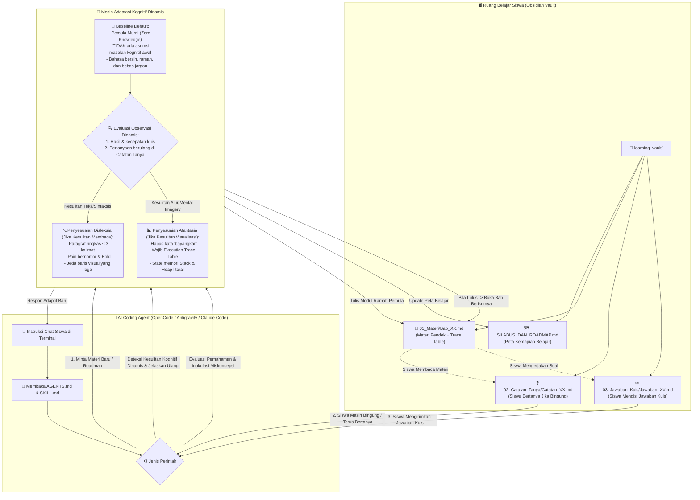

# 📱 Inclusive Cognitive AI Code Tutor & Learning Vault

Selamat datang di platform tutor pemrograman bertenaga AI yang dirancang dengan pendekatan **inklusif kognitif**: ramah untuk **pemula tanpa dasar coding (*zero-knowledge*)**, serta adaptif bagi pembelajar dengan **disleksia** dan **afantasia (*aphantasia*)**.

Repositori ini mengintegrasikan dua komponen utama:
1. **AI Agent Skill & Rules** (untuk **OpenCode**, **Antigravity IDE**, **Claude Code**, **Gemini CLI**, **Cursor**, dll.) yang berinteraksi langsung dengan siswa melalui catatan di **Obsidian**.
2. **Core Python Engine & Test Harness** (berbasis State Machine & Sandbox Execution).

---

## 📑 Daftar Isi
1. [Di Mana Proyek Ini Ditaruh?](#-1-di-mana-proyek-ini-ditaruh)
2. [Panduan Instalasi & Setup Lengkap](#-2-panduan-instalasi--setup-lengkap)
   - [Setup di OpenCode](#a-setup-di-opencode-cli)
   - [Setup di Antigravity IDE](#b-setup-di-antigravity-ide)
   - [Setup di Claude Code / Gemini CLI](#c-setup-di-claude-code--gemini-cli)
   - [Setup di Cursor / Windsurf / VS Code](#d-setup-di-cursor--windsurf--vs-code)
   - [Setup Obsidian (Aplikasi Tempat Belajar Siswa)](#e-setup-obsidian-aplikasi-belajar-siswa)
   - [Setup Python Engine AdaptiQ (Opsional / Standalone CLI)](#f-setup-python-engine-adaptiq-opsional--standalone-cli)
3. [Alur Kerja & Arsitektur Sistem (Flowchart)](#-3-alur-kerja--arsitektur-sistem-flowchart)
4. [Apakah Hanya untuk Java atau Bisa Banyak Bahasa Pemrograman?](#-4-apakah-hanya-untuk-java-atau-bisa-banyak-bahasa-pemrograman)
5. [Evaluasi Pedagogis Materi: Pemula Murni (Zero-Knowledge) vs Java Mobile](#-5-evaluasi-pedagogis-materi-pemula-murni-vs-java-mobile)
6. [Fitur Generator Silabus & Roadmap Belajar](#-6-fitur-generator-silabus--roadmap-belajar)

---

## 📍 1. Di Mana Proyek Ini Ditaruh?

Proyek ini dapat diletakkan di **folder mana pun di komputer Anda** (baik di Windows, macOS, maupun Linux). Anda cukup meng-clone repositori ini dari GitHub:

```bash
# Clone repositori ke komputer Anda
git clone https://github.com/Lasains/adaptiq-subagent.git

# Masuk ke direktori proyek
cd adaptiq-subagent
```

### Struktur Hierarki Folder Proyek:
```text
adaptiq-subagent/                     <-- Root Direktori Proyek (Buka folder ini di Agent CLI/IDE)
├── AGENTS.md                         <-- Aturan utama yang dibaca semua AI Agent CLI
├── OPENCODE.md                       <-- File pemandu khusus untuk OpenCode CLI
├── CLAUDE.md                         <-- File pemandu untuk Claude Code
├── README.md                         <-- Dokumentasi & panduan instalasi (berkas ini)
│
├── .agents/                          <-- Direktori Skill AI Agent
│   └── skills/
│       └── java-tutor/
│           └── SKILL.md              <-- Definisi & aturan pedagogis Subagent Tutor
│
├── learning_vault/                   <-- BUKA FOLDER INI SEBAGAI VAULT DI OBSIDIAN!
│   ├── SILABUS_DAN_ROADMAP.md        <-- Peta jalan belajar dari nol sampai mahir
│   ├── README_OBSIDIAN.md            <-- Panduan praktis bagi siswa di Obsidian
│   ├── 01_Materi/                    <-- Tempat subagent menulis materi belajar (Bab_XX.md)
│   ├── 02_Catatan_Tanya/             <-- Tempat siswa menulis pertanyaan jika ada yang bingung
│   └── 03_Jawaban_Kuis/              <-- Tempat siswa menjawab kuis/tantangan
│
├── adaptiq/                          <-- Kode sumber Python Core Engine (LangGraph, Sandbox, dll.)
└── tests/                            <-- Pengujian otomatis & evaluasi kualitas kurikulum
```

> [!TIP]
> **Dua Tempat Kerja Utama**: 
> - **Ruang Kerja AI Agent**: Buka folder root proyek (`adaptiq-subagent/`) di terminal OpenCode / Antigravity / Claude Code.
> - **Ruang Belajar Siswa**: Buka sub-folder `learning_vault/` yang ada di dalam proyek Anda sebagai **Vault** di aplikasi **Obsidian**.

---

## 🛠️ 2. Panduan Instalasi & Setup Lengkap

Anda dapat menjalankan subagent ini melalui berbagai alat AI Coding Agent favorit Anda:

### A. Setup di OpenCode CLI
OpenCode adalah AI Coding Assistant terminal berbasis LLM. Cara men-setup subagent ini di OpenCode:

1. **Buka Terminal** dan masuk ke direktori proyek Anda:
   ```bash
   cd adaptiq-subagent
   ```
2. **Jalankan OpenCode**:
   ```bash
   opencode
   ```
3. **Bagaimana OpenCode mengenali Subagent Tutor?**
   - OpenCode secara otomatis membaca file instruksi di root folder: [`OPENCODE.md`](OPENCODE.md) dan [`AGENTS.md`](AGENTS.md).
   - Di dalam file tersebut, OpenCode sudah diinstruksikan untuk memuat aturan pedagogis dari [`.agents/skills/java-tutor/SKILL.md`](.agents/skills/java-tutor/SKILL.md).
4. **Mulai Belajar**:
   Cukup ketik prompt di OpenCode:
   ```text
   Halo! Saya mau mulai belajar Java dari nol murni untuk persiapan mobile programming. Tolong siapkan Silabus dan Bab 1 di learning_vault!
   ```

---

### B. Setup di Antigravity IDE
Antigravity IDE secara bawaan (*native*) mendukung sistem modular Skill dan Rules:

1. Buka folder proyek (`adaptiq-subagent`) di **Antigravity IDE** (`File` -> `Open Folder`).
2. Antigravity akan otomatis mendeteksi skill di `.agents/skills/java-tutor/SKILL.md` dan aturan di `AGENTS.md`.
3. Anda dapat langsung memanggil tutor di panel chat Antigravity:
   ```text
   Tutor, tolong buatkan Bab 1 materi Java dasar untuk pemula murni di learning_vault/01_Materi/
   ```

---

### C. Setup di Claude Code / Gemini CLI
1. Buka terminal di folder proyek:
   ```bash
   cd adaptiq-subagent
   ```
2. Jalankan Claude Code atau Gemini CLI:
   ```bash
   claude
   ```
3. Claude Code otomatis membaca [`CLAUDE.md`](CLAUDE.md) dan [`AGENTS.md`](AGENTS.md) saat sesi dimulai.
4. Anda bisa langsung memberikan instruksi pengajaran atau pemeriksaan kuis.

---

### D. Setup di Cursor / Windsurf / VS Code
1. Buka folder proyek (`adaptiq-subagent`) di Cursor atau VS Code.
2. File konfigurasi `AGENTS.md` akan menjadi pemandu konteks bagi AI Chat (seperti Cursor Composer atau Windsurf Cascade).

---

### E. Setup Obsidian (Aplikasi Belajar Siswa)
Siswa membaca materi dan mengerjakan soal di aplikasi catatan populer **Obsidian**:

1. Unduh dan buka aplikasi **Obsidian** (dari [obsidian.md](https://obsidian.md)).
2. Pada menu awal Obsidian, pilih **"Open folder as vault"** (Buka folder sebagai vault).
3. Pilih subfolder `learning_vault` yang berada di dalam folder proyek Anda:
   ```text
   <lokasi-proyek>/adaptiq-subagent/learning_vault
   ```
4. Selesai! Semua materi yang di-generate oleh AI Agent akan langsung muncul dan tersinkronisasi seketika di sidebar Obsidian Anda dengan format Markdown yang indah dan mudah dibaca.

---

### F. Setup Python Engine Core (Opsional / Standalone CLI)
Jika Anda ingin menjalankan Core Engine Python (misalnya untuk menjalankan simulasi LangGraph otomatis, evaluasi benchmark kurikulum, atau grading code sandbox):

1. **Pastikan Python 3.11+ terinstal**, lalu buka terminal di folder proyek:
   ```bash
   cd adaptiq-subagent
   python -m venv .venv
   ```
   - Di Windows: `.\.venv\Scripts\activate`
   - Di macOS/Linux: `source .venv/bin/activate`
   ```bash
   pip install -r requirements.txt
   ```
2. **Jalankan Perintah CLI**:
   ```bash
   # Memulai sesi belajar baru
   python -m adaptiq.cli.main start --topic "Java Programming Fundamentals" --learner-id "siswa_01"

   # Memeriksa status kognitif & sesi
   python -m adaptiq.cli.main status

   # Menjalankan evaluasi pengujian otomatis
   pytest tests/test_java_mobile_eval.py -v
   ```

---

## 🔄 3. Alur Kerja & Arsitektur Sistem (Flowchart)

Berikut adalah diagram alur kerja (*flowchart*) interaksi menyeluruh antara Siswa, Vault Obsidian, AI Coding Agent, dan Mesin Adaptasi Kognitif:



### 🧠 Prinsip Diagnosa & Adaptasi Kognitif Dinamis:
1. **Baseline Awal (Tanpa Masalah Kognitif)**:
   Secara *default*, semua pengguna diposisikan sebagai **Pemula Murni (*Zero-Knowledge Beginner*)**, yaitu seseorang yang baru pertama kali menyentuh dunia coding. Di awal, sistem **TIDAK** berasumsi bahwa pengguna memiliki masalah kognitif (disleksia atau afantasia).
2. **Evaluasi Kecepatan & Kuis**:
   Ketika pengguna mulai menjawab kuis atau tantangan logika, kecepatan dan akurasi mereka menjadi bahan pertimbangan agen untuk mengukur apakah pengguna benar-benar pemula nol atau sudah memiliki intuisi logika komputasi.
3. **Pemicu Adaptasi Kognitif (Pertanyaan Berulang)**:
   Ketika materi baru diberikan dan pengguna **tetap masih bertanya atau masih kesusahan memahami setiap penjelasan** di [`learning_vault/02_Catatan_Tanya/`](learning_vault/02_Catatan_Tanya/), agen secara cerdas mengidentifikasi jenis kesulitan yang dihadapi:
   - Jika pengguna kewalahan membaca teks padat atau tanda kurung ➔ Agen mengaktifkan adaptasi **Disleksia** (format poin pendek, kata kunci tebal, jeda baris lega).
   - Jika pengguna bingung membayangkan alur data atau analogi abstrak ➔ Agen mengaktifkan adaptasi **Afantasia** (menghilangkan kata *"bayangkan"*, menyajikan **Execution Trace Table** literal step-by-step).

---

## 🌐 4. Apakah Hanya untuk Java atau Bisa Banyak Bahasa Pemrograman?

### Jawaban Singkat:
> **Arsitektur dan Mesin Pedagogis AdaptiKog bersifat AGNOSTIK (Bisa untuk SEMUA bahasa pemrograman!)**

### Penjelasan Detail:
1. **Pemisahan Antara Engine vs Skill Preset**:
   - **Prinsip Kognitif Universal**: Aturan penanganan Disleksia (teks ringkas terstruktur), Afantasia (Execution Trace Table), dan Zero-Knowledge (analogi mekanis nyata) berlaku sama untuk bahasa apa pun — baik Python, JavaScript, Kotlin, Rust, C++, maupun Go.
   - **Preset Aktif Saat Ini**: Repositori ini dikonfigurasi dengan preset awal **`java-tutor`** (menggunakan Java JDK 21 LTS) dengan tujuan akhir memprogram aplikasi mobile.
2. **Cara Menambah atau Mengganti ke Bahasa Pemrograman Lain**:
   Sangat mudah! Anda cukup:
   - **Opsi A (Melalui Chat ke Agent)**:  
     Cukup katakan: *"Tutor, saya ingin belajar Python dari nol dengan format adaptif kognitif yang sama."* Agen akan secara otomatis menyesuaikan sintaksis ke Python sambil tetap mempertahankan Trace Table dan format ramah disleksia.
   - **Opsi B (Menambahkan Skill Baru)**:  
     Duplikasi folder `.agents/skills/java-tutor/` menjadi `.agents/skills/python-tutor/`, lalu ubah target bahasa di file `SKILL.md`.

---

## 🔍 5. Evaluasi Pedagogis Materi: Pemula Murni (Zero-Knowledge) vs Java Mobile

### Kritik & Temuan Kritis pada Materi Sebelumnya:
Pada uji coba modul terdahulu (contoh: `Bab_01_Layar_HP_TextView.md`), materi langsung melompat ke konsep:
*"Layar HP & Menampilkan Teks Pertama (TextView & String)"* dengan menggunakan kode `System.out.println` yang disebut sebagai "mencetak ke layar HP".

### Mengapa Ini Bermasalah untuk Pemula Murni (*Zero-Knowledge*)?
1. **Mencampuradukkan Konsep (*Conceptual Confusion*)**:
   `System.out.println` adalah perintah mencetak teks ke **Konsol Terminal Komputer**, bukan layar aplikasi Android Mobile yang sesungguhnya. Menyebutnya sebagai "layar kaca HP" dapat menanamkan miskonsepsi fundamental saat siswa nanti belajar Android sesungguhnya (di mana teks diatur menggunakan layout XML / Jetpack Compose dan objek `TextView`).
2. **Ketiadaan Fondasi Logika Komputasi**:
   Siswa pemula murni belum memahami:
   - Apa itu eksekusi program baris-demi-baris?
   - Apa perbedaan angka `100` dengan teks `"100"`?
   - Bagaimana komputer mengambil keputusan (`if-else`) dan mengulang pekerjaan (`loop`)?
   - Apa itu Objek dan Class (padahal Android berbasis 100% pada *Object-Oriented Programming*)?

### Solusi Pedagogis: *The 3-Phase Scaffolding Pathway*
Agar siswa memiliki pondasi yang kokoh tanpa kebingungan, alur pengajaran dibagi menjadi 3 fase terukur:

```text
┌────────────────────────────────────────────────────────┐
│ FASE 1: Fondasi Bahasa & Logika Java Murni (Bab 1 - 5)  │
│ - Apa itu Program, Variabel, Tipe Data, Operator       │
│ - Percabangan Logika (if-else) & Perulangan (for/while)│
│ - Fungsi / Method & Pengolahan Data                    │
└──────────────────────────┬─────────────────────────────┘
                           │ Fondasi logika kuat
                           ▼
┌────────────────────────────────────────────────────────┐
│ FASE 2: Pemrograman Berorientasi Objek / OOP (Bab 6 - 8)│
│ - Class & Object: Mengapa Java butuh Objek?            │
│ - Method & Parameter: Perilaku sebuah benda            │
│ - Pewarisan (Inheritance): Fondasi komponen Android   │
└──────────────────────────┬─────────────────────────────┘
                           │ Mengerti konsep Objek UI
                           ▼
┌────────────────────────────────────────────────────────┐
│ FASE 3: Jembatan ke Pemrograman Mobile Android (Bab 9+)│
│ - Layar HP sesungguhnya: Layout XML & Komponen Visual  │
│ - Menghubungkan Objek Java dengan Widget Layar (Button)│
│ - Event Handling: Apa yang terjadi saat layar disentuh │
└────────────────────────────────────────────────────────┘
```

---

## 🗺️ 6. Fitur Generator Silabus & Roadmap Belajar

Agent Tutor ini dilengkapi kemampuan untuk merancang **Silabus & Roadmap Belajar Terstruktur** sebelum bab pertama dimulai, sehingga siswa memiliki gambaran menyeluruh tentang perjalanan belajarnya.

Peta jalan lengkap telah disediakan di:
👉 [`learning_vault/SILABUS_DAN_ROADMAP.md`](learning_vault/SILABUS_DAN_ROADMAP.md)

### Cara Meminta Agen Membuat atau Memodifikasi Roadmap:
Ketik perintah ini di jendela chat OpenCode / Antigravity / Claude Code:
```text
Tutor, tampilkan Silabus Belajar saya dan periksa bab mana yang siap kita pelajari hari ini!
```
Atau jika Anda ingin fokus ke topik khusus:
```text
Tutor, tolong modifikasi roadmap saya agar menyertakan materi persiapan proyek aplikasi Kasir Sederhana di HP!
```

---

<p align="center">
  <b>AdaptiKog</b> — <i>Membuka Pintu Dunia Pemrograman untuk Setiap Pikiran Manusia.</i>
</p>
